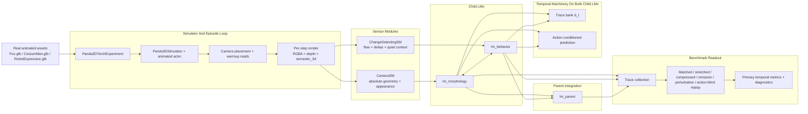
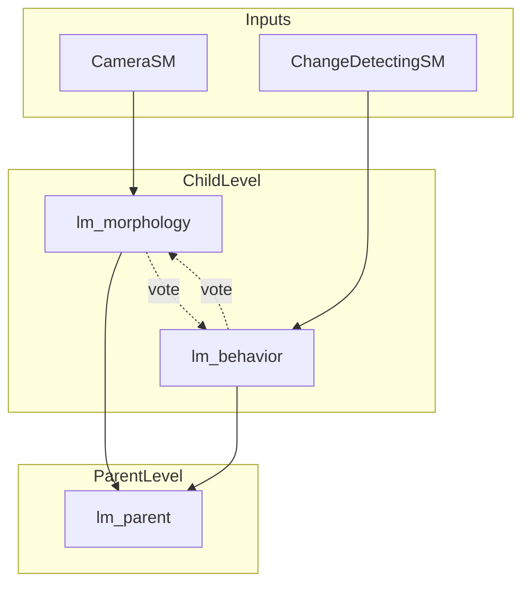
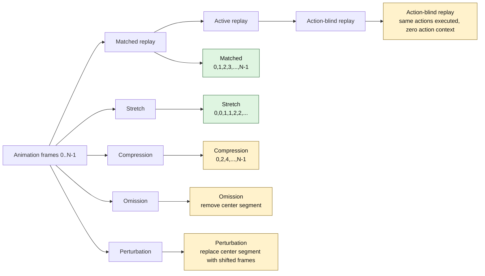
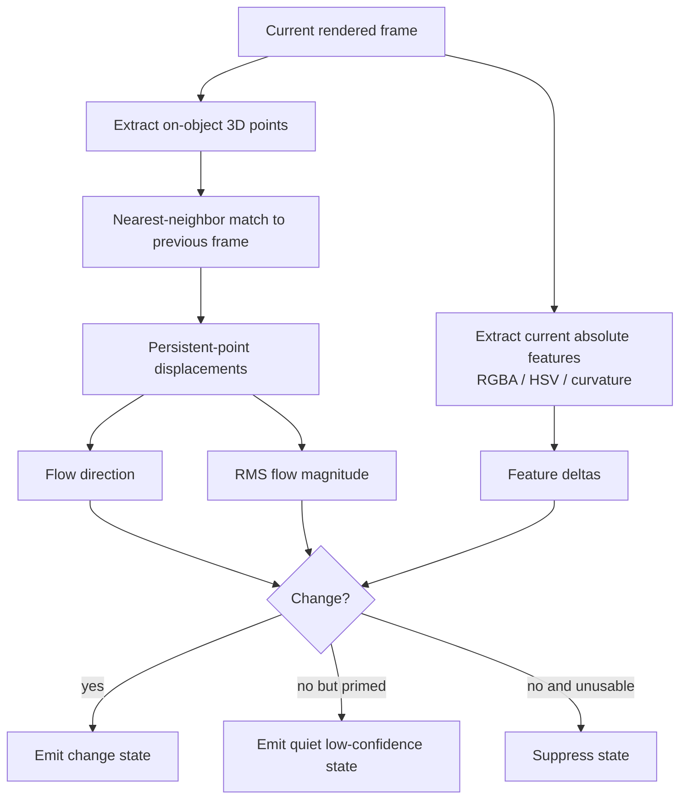

# Track 12 Benchmark Schematic And Math Walkthrough

This document explains the current Track 12 real-asset falsifier benchmark as it is implemented now.

It focuses on the current default path:

- real animated assets only
- no default semi-Markov inference path
- child LM temporal parity between `lm_morphology` and `lm_behavior`
- primary temporal carrier is the multi-timescale trace bank `d_t`

## 1. One-Screen Summary

The benchmark asks a narrow question:

Can a column-like model use recent local temporal context to stay predictive when a real animation is replayed normally, stretched, compressed, omitted, perturbed, or replayed without action context?

The current hierarchical setup is:

- `CameraSM -> lm_morphology`
- `ChangeDetectingSM -> lm_behavior`
- `lm_parent` reads both child LMs
- `lm_morphology` and `lm_behavior` now have the same default Track 12 temporal stack

The core online temporal state is:

$$
h_t = (x_t, d_t)
$$

where:

- $x_t$ is the fast settled column state
- $d_t$ is the multi-timescale trace bank used as online temporal context

## 2. Full Experiment Schematic



## 3. Wiring Diagram Of The Hierarchy



Interpretation:

- `lm_morphology` sees dense absolute camera features
- `lm_behavior` sees motion and change-oriented features, but now also carries quiet absolute context
- the parent LM is an integrator above both children
- the child LMs can exchange votes laterally

## 4. Benchmark Conditions Schematic



Exact schedule construction in the benchmark is:

Matched:

$$
S_{\text{matched}} = [0,1,2,\dots,N-1]
$$

Stretch by factor $r$:

$$
S_{\text{stretch}} = [\underbrace{0,\dots,0}_{r},\underbrace{1,\dots,1}_{r},\dots,\underbrace{N-1,\dots,N-1}_{r}]
$$

Compression by stride $s$:

$$
S_{\text{compress}} = [0,s,2s,\dots,N-1]
$$

Omission removes a deterministic center window.

Perturbation replaces that same center window with a shifted version of the same animation.

Action-blind replay replays the exact executed actions from matched replay, but sets the action-context vector to zero.

## 5. The Main Variables

| Symbol | Meaning | In code terms |
|---|---|---|
| $i_t$ | current sensory drive | current rendered observation |
| $x_t$ | fast settled state | column active state after `column.step()` |
| $d_t$ | temporal trace bank | `_temporal_trace_bank` and `_temporal_trace_vector` |
| $\beta_t$ | boundary pressure | `_temporal_boundary_pressure` |
| $\epsilon_t$ | mismatch or surprise | `column.surprise` and `prediction_mismatch` |
| $u_t$ | action context | 8-D action-context vector |
| $\chi_t$ | retrieval query | sensory encoding plus temporal query bias |
| $\hat{i}_t$ | predicted next input | implicit in action-conditioned prediction and mismatch |

## 6. Observation Math: CameraSM

`CameraSM` is the dense absolute observation stream.

Pipeline:

1. Panda3D renders RGBA, depth, and semantics.
2. `DepthTo3DLocations` converts depth into world-coordinate 3D points.
3. `ObservationProcessor` extracts per-step state features.
4. The state is sent to `lm_morphology`.

Conceptually:

$$
o_t^{\text{camera}} \rightarrow \text{3D points} \rightarrow \text{features at location} \rightarrow s_t^{\text{morph}}
$$

By default the camera stream includes:

- pose vectors
- on-object status
- HSV color

This is the stable, dense, absolute stream.

## 7. Observation Math: ChangeDetectingSM

`ChangeDetectingSM` is the behavior-side observation stream.

It uses two things from consecutive frames:

- the current on-object point cloud
- the previous on-object point cloud

### 7.1 Center location

The sensor uses the mean of all on-object 3D points as its center location:

$$
\ell_t = \frac{1}{|P_t|}\sum_{p \in P_t} p
$$

### 7.2 Persistent-point correspondence

Let $P_t = \{p_i^t\}$ be current on-object points and $P_{t-1}$ the previous ones.

For each current point, find its nearest previous point. Keep only pairs inside the correspondence threshold $\tau_c$.

$$
\Delta p_i = p_i^t - p_{\mathrm{nn}(i)}^{t-1}
$$

### 7.3 Flow direction and flow magnitude

Mean displacement gives the dominant direction:

$$
\bar{\Delta p}_t = \frac{1}{K}\sum_{i=1}^K \Delta p_i
$$

$$
u_t^{\text{flow}} =
\begin{cases}
\bar{\Delta p}_t / \|\bar{\Delta p}_t\| & \text{if } \|\bar{\Delta p}_t\| > 0 \\
0 & \text{otherwise}
\end{cases}
$$

RMS displacement gives flow magnitude:

$$
m_t^{\text{flow}} = \sqrt{\frac{1}{K}\sum_{i=1}^K \|\Delta p_i\|^2}
$$

If there are too few persistent points, the sensor falls back to centroid displacement.

### 7.4 Feature deltas

The behavior sensor also computes absolute features and their deltas:

$$
\Delta f_t = f_t - f_{t-1}
$$

Current absolute features can include:

- center RGBA
- center HSV
- center-patch curvature summary `principal_curvatures_log`

### 7.5 Change decision

Change is declared when motion or any feature delta crosses threshold:

$$
\text{change}_t =
\big(m_t^{\text{flow}} > \tau_{\text{flow}}\big)
\;\lor\;
\big(\exists j:\; |\Delta f_{t,j}| > \tau_{f,j}\big)
$$

If no strong change is detected, the current implementation can still emit a low-confidence quiet state.

That matters because the behavior stream is no longer forced to go silent on quiet frames.

### 7.6 Behavior sensor infographic



## 8. Action Context Math

The experiment encodes executed actions into an 8-D vector.

A readable interpretation is:

$$
a_t = [f_t, y_t, p_t, l_t, v_t, n_t, n_t^{\text{trans}}, n_t^{\text{rot}}]
$$

where roughly:

- $f_t$: forward displacement
- $y_t$: yaw change
- $p_t$: pitch change
- $l_t$: lateral displacement
- $v_t$: vertical displacement
- $n_t$: number of actions
- $n_t^{\text{trans}}$: number of translation-like actions
- $n_t^{\text{rot}}$: number of rotation-like actions

This vector is sent to every LM each step.

In active replay, the recorded action vector is replayed normally.

In action-blind replay:

$$
a_t = 0
$$

while the same physical actions are still executed in the simulator.

That isolates the effect of efference copy.

## 9. Core Track 12 Causal Loop In The Current Code

The intended Track 12 causal loop is:

$$
h_t = (x_t, d_t)
$$

with trace-biased inference and action-conditioned prediction.

### 9.1 High-level causal loop

```mermaid
flowchart LR
    A[Current observation s_t] --> B[Encode sensory state]
    H[Previous trace d_{t-1}] --> C[Trace-derived Hopfield query bias]
    U[Action context a_t] --> D[Action-conditioned prediction context]
    B --> E[column.step]
    C --> E
    D --> E
    E --> F[Settled active state x_t]
    F --> G[Base object evidence]
    F --> I[Boundary pressure beta_t]
    I --> J[Trace retention gate]
    F --> K[Trace drive]
    D --> K
    J --> L[Update trace bank d_t]
    K --> L
    L --> M[Mean trace vector]
    M --> C
```

### 9.2 Important implementation detail

In the current default benchmark, time affects inference primarily before the next matching step.

That is:

- previous trace state becomes a Hopfield query bias before `column.step()`
- current step then settles and updates the trace bank
- no default semi-Markov temporal-evidence injection is active afterward

So the default path is not “match first, then repair with Markov labels.”

It is “use the previous trace to bias the next match.”

## 10. Boundary Pressure Math

Boundary pressure is computed from mismatch plus discontinuity.

### 10.1 Settle displacement

Let $x_t^{\text{pre}}$ be the pre-settle active state and $x_t$ the settled one.

$$
\delta_t^{\text{settle}} =
\frac{\|x_t - x_t^{\text{pre}}\|_1}
{\|x_t\|_1 + \|x_t^{\text{pre}}\|_1}
$$

### 10.2 Correction mismatch

The code also uses:

$$
\delta_t^{\text{corr}} = \max(0, \text{prediction\_mismatch}_t - \text{surprise}_t)
$$

### 10.3 Mismatch summary

The working mismatch term is the maximum of several cues:

$$
m_t = \max\Big(
\text{surprise}_t,
0.5\,\delta_t^{\text{settle}},
0.5\,\delta_t^{\text{corr}},
w_a\,\text{action\_prediction\_error}_t
\Big)
$$

The action term only matters if action-conditioned prediction is active.

### 10.4 Discontinuity

Let $x_{t-1}$ be the previous settled active state.

$$
\kappa_t =
\frac{\|x_t - x_{t-1}\|_1}
{\|x_t\|_1 + \|x_{t-1}\|_1}
$$

### 10.5 Pressure logit and pressure

$$
z_t = w_s m_t + w_d \kappa_t - \theta
$$

$$
\beta_t = \sigma(z_t) = \frac{1}{1 + e^{-z_t}}
$$

This is the scalar gate that says whether the current regime feels stable or boundary-like.

## 11. Trace Bank Math

The trace bank contains $K$ lanes with different decay rates.

$$
d_t = \big(d_t^{(1)}, d_t^{(2)}, \dots, d_t^{(K)}\big)
$$

Each lane has a decay $\lambda_k$ and integration $1-\lambda_k$.

### 11.1 Retention term

$$
r_t^{(k)} = (1 - \beta_t)\,\lambda_k
$$

When boundary pressure is high, trace retention drops.

### 11.2 Drive term

The core drive is the settled active state scaled by the lane integration rate:

$$
g_t^{(k)} = \eta\,(1-\lambda_k)\,x_t
$$

If action-conditioned query bias exists, an extra normalized action-driven term is added.

### 11.3 Lane update

$$
d_t^{(k)} = r_t^{(k)} d_{t-1}^{(k)} + g_t^{(k)}
$$

### 11.4 Mean trace vector used for inference

The implementation then collapses the bank to a mean trace vector:

$$
\bar{d}_t = \frac{1}{K}\sum_{k=1}^K d_t^{(k)}
$$

That mean vector is normalized and fed back as the next Hopfield query bias.

### 11.5 Trace infographic

```mermaid
flowchart TD
    A[Settled active state x_t] --> B[Compute boundary pressure beta_t]
    C[Previous trace bank d_{t-1}^{(k)}] --> D[Retention r_t^{(k)} = (1-beta_t) lambda_k]
    A --> E[Drive g_t^{(k)} = eta (1-lambda_k) x_t]
    F[Optional action bias] --> E
    D --> G[Lane update]
    E --> G
    G --> H[d_t^{(k)}]
    H --> I[Average across scales]
    I --> J[Normalized Hopfield query bias for next step]
```

## 12. What Is Reported As Temporal Surprise

In the current default path, reported temporal surprise mainly comes from the larger of:

- the column surprise
- the temporal boundary pressure

Conceptually:

$$
\text{temporal\_surprise}_t \approx \max(\text{column\_surprise}_t, \beta_t)
$$

because the default benchmark is not using self-supervised temporal state discovery as the main inference path.

## 13. Training And Evaluation Episodes

### 13.1 Training

For each object:

1. load the real asset
2. choose an animation
3. build a matched frame schedule
4. train with `object_name` as the graph key
5. do not provide temporal labels
6. fit only a post hoc latent-phase decoder for diagnostics

### 13.2 Evaluation

For each object, evaluate:

- matched replay
- active replay using the recorded action sequence
- action-blind replay using the same physical actions but zero action context
- stretched replay
- compressed replay
- omission replay
- perturbation replay

## 14. Primary Metrics Math

The benchmark aggregates primary metrics from the chosen target LM trace.

### 14.1 Mean surprise

$$
\overline{s} = \frac{1}{T}\sum_{t=1}^T \text{temporal\_surprise}_t
$$

### 14.2 Mean boundary pressure

$$
\overline{\beta} = \frac{1}{T_\beta}\sum_{t=1}^{T_\beta} \beta_t
$$

### 14.3 Boundary-active fraction

For threshold $\theta_\beta^{\text{active}}$:

$$
f_{\text{active}} =
\frac{1}{T_\beta}
\sum_{t=1}^{T_\beta}
\mathbf{1}[\beta_t \ge \theta_\beta^{\text{active}}]
$$

### 14.4 Event fraction

$$
f_{\text{event}} =
\frac{1}{T}
\sum_{t=1}^{T}
\mathbf{1}[\text{event\_detected}_t]
$$

### 14.5 Recovery steps to confident

Starting from a recovery anchor, recovery is the first position where three consecutive statuses are `confident`.

In the current default path this is often `null`, because no self-supervised temporal-state status is being emitted.

## 15. Windowed Omission And Perturbation Math

For omission and perturbation, the benchmark compares a condition window against the matched baseline window.

For example:

$$
\Delta_{\text{surprise}} =
\overline{s}_{\text{condition window}} - \overline{s}_{\text{matched baseline window}}
$$

Similarly:

$$
\Delta_{\text{pressure}} =
\overline{\beta}_{\text{condition window}} - \overline{\beta}_{\text{matched baseline window}}
$$

$$
\Delta_{\text{active}} =
f_{\text{active, condition}} - f_{\text{active, baseline}}
$$

The aggregate report averages these deltas across models.

## 16. Action-Blind Replay Math

The action-blind replay metric asks:

What changes if the exact same physical camera trajectory is replayed, but the LMs do not get the action vector?

The delta is always computed as:

$$
\Delta_{\text{blind-active}} = \text{blind replay} - \text{active replay}
$$

So a negative action-blind surprise delta means the blind replay produced lower reported surprise than the active replay.

## 17. Secondary Phase Decoder Math

The benchmark still contains a secondary diagnostic that maps latent labels to motion phase bins.

During training it counts which phase bin appears most often for each latent label:

$$
\text{decoder}(\ell) = \arg\max_{p} \; \text{count}(\ell, p)
$$

This is only a diagnostic.

It is not the primary Track 12 mechanism.

In the current default non-Markov path, these phase metrics are often `null` because the benchmark is no longer learning latent semi-Markov labels by default.

## 18. What Is On And Off In The Current Default Benchmark

| Mechanism | Current default | Why it matters |
|---|---|---|
| Real animated assets | On | benchmark uses real meshes only |
| Child LM temporal parity | On | morphology and behavior receive the same default temporal stack |
| Multi-timescale trace bank | On | this is the main online temporal state |
| Action-conditioned prediction | On | lets action context shape the next query and boundary pressure |
| Semi-Markov latent-state inference | Off by default | no longer part of the default inference path |
| Self-supervised temporal evidence injection | Off by default | no post hoc label-based rescue by default |
| Temporal behavior evidence weighting | Off by default | current default path is trace-biased rather than evidence-afterburner |
| Motion-phase decoder | Secondary only | retained for diagnostics, not training |

## 19. Practical Reading Guide

If you want the simplest way to read the system, use this order:

1. The simulator produces a rendered frame.
2. The two sensor modules turn that frame into two different state descriptions.
3. Each child LM matches its state while receiving temporal query bias from the previous trace and action context.
4. The settled child state updates boundary pressure and the multi-timescale trace bank.
5. The benchmark compares how that system behaves under schedule distortions and action-context ablation.

## 20. The Short Intuition

The current Track 12 benchmark is easiest to understand as:

"A real-animation recognition benchmark where each child LM tries to recognize the current object while carrying a fading memory of recent local dynamics, and the benchmark checks whether that memory changes behavior when time is distorted or action context is removed."

That is the whole point of the setup.