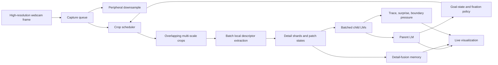

# Track 13: Foveated Detail Accretion And Live Perception

## Goal

Extend the current Track 12 predictive stack into a perception architecture that
can:

- preserve much higher local visual detail, including from a webcam-like live
  source
- accumulate that detail across time instead of collapsing each frame to one
  state
- remain compatible with the current Track 12 temporal and attention machinery
- run live on a decent machine at at least 5 frames per second
- expose a live visualization of what the system is currently predicting,
  storing, and learning

## Depends On

- [track-12-cortical-time-and-predictive-state.md](track-12-cortical-time-and-predictive-state.md)
- [track-12-temporal-attention-compatibility-matrix.md](track-12-temporal-attention-compatibility-matrix.md)
- [track-10-deep-heterarchy-and-biological-depth.md](track-10-deep-heterarchy-and-biological-depth.md)
- [track-11-deep-hierarchy-and-gpu-scaling.md](track-11-deep-hierarchy-and-gpu-scaling.md)
- [track-6-predictive-coding-heterarchy.md](track-6-predictive-coding-heterarchy.md)
- [track-1-multi-column-intelligence.md](track-1-multi-column-intelligence.md)

Primary repo grounding for the current bottleneck and the feasible extension
surfaces:

- [sensor_modules.py](../src/tbp/monty/frameworks/models/sensor_modules.py)
- [change_detecting_sm.py](../src/tbp/monty/frameworks/models/change_detecting_sm.py)
- [encoders.py](../src/tbp/monty/frameworks/models/cortical_column_torch/encoders.py)
- [experiment.py](../src/tbp/monty/frameworks/models/cortical_column_torch/experiment.py)
- [agents.py](../src/tbp/monty/simulators/habitat/agents.py)
- [agents.py](../src/tbp/monty/simulators/panda3d/agents.py)
- [server.py](../src/tbp/monty/frameworks/environment_utils/server.py)
- [two_d_data.py](../src/tbp/monty/frameworks/environments/two_d_data.py)
- [world_image_from_stream.yaml](../src/tbp/monty/conf/experiment/config/environment/world_image_from_stream.yaml)

## Problem

Track 12 now has a real temporal core. The current default runtime is centered
on:

- predictive state $h_t = (x_t, d_t)$
- multi-timescale trace-bank context $d_t$
- action-conditioned prediction
- boundary pressure
- inferred-relative hidden-state geometry
- hierarchical child and parent context exchange
- conditional lateral voting

The attention story is also real, but it is not transformer QKV attention. The
implemented attention-like mechanisms are:

- Modern Hopfield retrieval and associative softmax readout
- location-feature partial-cue retrieval
- goal-state targeting from parent memory
- optional multi-head dendritic attention and Track 10 biological-depth gating

The main missing layer remains the same as in Track 12:

- no true parent-to-child predictive path
- no unified surprise-gated residual routing
- no learned dynamic attention routing

That means Track 13 should not pretend those missing routing features already
exist. It should build on the current Track 12 stack as it actually is.

The perception bottleneck is also now clear.

It is not only that some benchmarks use low resolutions like $32 \times 32$.
The deeper problem is that the current sensor pipeline compresses a whole patch
too early:

$$
O_t \rightarrow \text{one State} \rightarrow \text{narrow feature vector} \rightarrow \text{LM}
$$

In the current repo this early collapse happens in practice because:

- `ObservationProcessor` and `CameraSM` reduce an observation to one main state
- `ChangeDetectingSM` still emits one compact behavior state per observation
- `TorchFeatureEncoder` defaults to a narrow scalar feature bundle
- the stream-backed 2D live path waits on sequential files and starts from a
  single centered patch

Raising the raw image resolution without changing that compression step will not
produce human-like detail sensitivity. It will mostly produce a higher-resolution
input that is still summarized into one local state too soon.

## Main Claim

Track 13 should be defined as delayed summarization plus temporal detail
accretion.

The next perception stack should work like this:

$$
O_t \rightarrow \{s_t^{(1)}, \dots, s_t^{(K_t)}\} \rightarrow M_t \rightarrow x_t
$$

not like this:

$$
O_t \rightarrow s_t \rightarrow x_t
$$

where:

- $O_t$ is the current camera frame or RGBD frame
- $s_t^{(i)}$ are multiple partially overlapping local patch states
- $M_t$ is a multi-granularity detail memory that persists across frames and
  fixations
- $x_t$ is still the settled Track 12 local recurrent state used for matching

The key idea is simple:

- keep a cheap peripheral stream for broad context
- allocate several overlapping higher-detail crops for likely informative
  regions
- preserve those local fragments before summarizing them
- fuse them across time using motion, action context, and confidence
- let Track 12 prediction decide what should persist, what should reset, and
  where to look next

This is closer to foveated sensing, detail accretion, and active perception
than uniform full-frame upscaling.

## What Must Stay Fixed From Track 12

Track 13 should extend Track 12, not replace it.

The following commitments should remain intact:

- The main online LM state stays $h_t = (x_t, d_t)$.
- Boundary pressure remains the primary cheap online reset signal.
- Action-conditioned prediction remains important because live camera sensing is
  sensorimotor, not passive video classification.
- Hierarchical child and parent integration remains the right structure for
  morphology, behavior, and object-level fusion.
- Conditional lateral voting remains useful as the current routing mechanism.
- Hopfield retrieval remains the core associative-memory primitive.

Track 13 should explicitly treat the following as later work rather than hidden
assumptions:

- top-down predictive routing into children
- true surprise-gated upward residual communication
- learned dynamic attention routing between LM groups

Those are still Track 6 style follow-on work.

## Section 1: Sensor Layout

### Webcam-first interpretation

For a live webcam demo, the simplest path is not multiple physical cameras. It
is one full-resolution camera frame plus multiple logical crops.

That matters because the user requirement is overlapping patches that may
partially superimpose. Software-defined crops support that immediately.

A Track 13 live frame should therefore be decomposed into:

- one low-cost peripheral frame for broad scene context
- a small set of overlapping higher-detail crops
- optional persistent ROI tracks carried across frames

Each crop should have:

- center position
- scale or zoom level
- footprint or support mask
- overlap relations to neighboring crops
- provenance in time

The first version should allow overlap ratios around 25% to 75% depending on
the use case. The point is not neat tiling. The point is redundant local
evidence that can be fused over time.

### RGBD versus RGB-only modes

There should be two explicit Track 13 operating modes.

Mode A: RGBD or depth-backed detail sensing

- use current `DepthTo3DLocations` style geometry when depth is available
- this is the clean continuation of current Track 12 geometry assumptions
- suitable for Panda3D, Habitat, or iPad-style RGBD streaming

Mode B: webcam-first RGB detail sensing

- use image-plane patch geometry when metric depth is not available
- estimate motion with optical flow, fixation drift, and optional monocular
  depth if needed later
- treat this as an image-plane hidden-state variant, not as fake 3D

The webcam path is still valid for Track 13 because the main new question is
detail retention and temporal fusion, not only exact metric 3D reconstruction.

## Section 2: Multi-Granularity State And Memory

Track 13 should add memory granularity at three levels.

### Level 1: Detail shards

These are the smallest retained local units. A detail shard should contain more
than a center pixel or one average feature vector.

Each shard should retain:

- local position or image-plane anchor
- scale
- orientation or pose summary when available
- richer appearance descriptor
- local motion descriptor
- novelty and confidence
- timestamp or age
- source patch identity

### Level 2: Patch states

A patch state is a local grouped summary of several detail shards from one crop.
This is the level that feeds a child LM most naturally.

It should include:

- aggregated local descriptor
- patch-local geometry
- motion summary
- predicted continuation summary
- link to the underlying retained detail shards

### Level 3: Object detail memory

This is the across-time structure that lets the system accumulate detail from
multiple fixations and overlapping crops.

It should store:

- a set of merged local fragments
- competing hypotheses when alignment is uncertain
- confidence by region, not only per object
- provenance showing which observations created each fragment

This is the minimal structural answer to the user's request for increasing
memory granularity and fusing detail across time.

## Section 3: Richer Local Descriptions

Track 13 should stop treating one scalarized feature bundle as the main local
content carrier.

For each crop or detail shard, the local description should be widened to keep
more of the structure that the current pipeline discards.

Practical candidates:

- color moments or small histograms, not only center HSV
- local edge or texture summaries
- local curvature distribution when depth exists
- optical-flow direction and magnitude distributions, not only one global mean
- sparse keypoint-like descriptors or a tiny learned local embedding
- patch support mask and overlap metadata
- local pose vectors when available

This does not require a giant neural frontend. A compact, batched, multi-field
descriptor is already a major improvement over the current one-state-per-patch
collapse.

## Section 4: Temporal Detail Fusion

The important new Track 13 memory is not a second replacement for the trace
bank. It is a detail-fusion layer that works with the trace bank.

The fusion rule should be:

- align new local fragments to existing memory using action context, optical
  flow, depth, or image-plane transform
- merge when evidence is consistent
- keep competing fragments when alignment is uncertain
- decay or reset fragments when boundary pressure is high

A useful first abstract update is:

$$
M_t = (1 - \beta_t)\,\mathrm{warp}(M_{t-1}, u_t) \oplus \mathrm{merge}(S_t)
$$

where:

- $M_t$ is the current detail memory
- $\beta_t$ is Track 12 boundary pressure
- $u_t$ is motion or action context
- $S_t = \{s_t^{(i)}\}$ is the set of current patch states
- $\oplus$ means merge while preserving uncertainty when needed

The main role of Track 12 here is not replaced. It acts as the temporal control
system for what should persist, what should be reweighted, and when the detail
memory should partially reset.

## Section 5: Compatibility With Current Attention And Hierarchy

Track 13 should interpret attention in the current repo in a strict,
repo-grounded way.

### What Track 13 can already use

- Hopfield retrieval as content-addressable matching over local or object-level
  prototypes
- location-feature memory for partial-cue retrieval and likely next-view
  targeting
- goal-state motor control to choose where to fixate next
- optional Track 10 dendritic and laminar features as query-bias mechanisms

### What Track 13 should not overclaim yet

- no true dynamic router that learns which child LM should receive which packet
- no true top-down predictive child narrowing via `receive_prediction`
- no unified surprise-routed residual hierarchy yet

So the near-term Track 13 architecture should use:

- multiple child streams or batched child columns for patch groups
- a parent LM for identity and coarse integration
- conditional voting among sibling streams
- goal-state selection to drive the next fixation or crop allocation

That is enough for a meaningful live demo without inventing missing code.

## Section 6: Immediate Repo Hooks

Track 13 has clear implementation surfaces in the current repo.

### Sensor path

- `ObservationProcessor` in [sensor_modules.py](../src/tbp/monty/frameworks/models/sensor_modules.py)
  should stop assuming one final state per observation.
- `ChangeDetectingSM` in [change_detecting_sm.py](../src/tbp/monty/frameworks/models/change_detecting_sm.py)
  should be able to emit per-patch motion context, not only one compressed
  change summary.
- `TorchFeatureEncoder` in [encoders.py](../src/tbp/monty/frameworks/models/cortical_column_torch/encoders.py)
  should support wider local descriptors and batched patch encoding.

### Experiment path

- [experiment.py](../src/tbp/monty/frameworks/models/cortical_column_torch/experiment.py)
  already exposes a natural place for a multi-patch child setup.
- Habitat multi-sensor support in [agents.py](../src/tbp/monty/simulators/habitat/agents.py)
  is the cleanest existing path for true multiple sensors, resolutions, and
  zooms.
- Panda3D in [agents.py](../src/tbp/monty/simulators/panda3d/agents.py)
  is still single-camera shaped, so webcam-first multi-crop should be done as
  logical crops from one frame before any deeper Panda3D multi-camera work.

### Live stream path

- [server.py](../src/tbp/monty/frameworks/environment_utils/server.py)
  plus [two_d_data.py](../src/tbp/monty/frameworks/environments/two_d_data.py)
  already prove that live streamed world images are conceptually supported.
- But the current path is file-drop based, blocks while waiting, and expects
  separate RGB and depth files. That is not a 5 fps webcam architecture.

The immediate live path should therefore be a direct frame queue, not the
current sequential file polling loop.

## Section 7: Webcam-First Track 13 Architecture

The first live demo architecture should look like this.

The most important design choice here is that crop scheduling and patch fusion
sit before the final LM summary rather than after it.

## Section 8: Performance Target And 5 FPS Budget

Track 13 must be designed around an explicit operating point.

The correct strategy is not:

- run one giant full-resolution patch through the whole stack every frame

The correct strategy is:

- keep peripheral context cheap
- batch several limited foveal crops
- update only the crops that matter
- reuse cached local memory when a region is quiet

### Target operating modes

| Mode | Intended use | Sensor load | Likely performance target |
|---|---|---|---|
| Debug | fast iteration | one peripheral frame + 2 small crops | comfortably above 5 fps on CPU-class hardware |
| Live demo | webcam demonstration | one peripheral frame + 4 to 6 overlapping crops | 5 to 10 fps on a decent laptop or desktop |
| Research | richer detail accumulation | one peripheral frame + 6 to 8 larger crops + heavier descriptors | may require Track 11 style batching or GPU help |

These are design targets, not measured benchmarks yet.

### Practical runtime rules

- Crop from one captured frame instead of invoking multiple physical camera
  renders.
- Batch local descriptor extraction across crops.
- Run heavy fusion or reclustering less often than every frame.
- Reuse quiet-region memory rather than recomputing full local descriptions
  every step.
- Decouple capture, inference, and UI rendering with queues.
- Keep the visualization path read-only and cheap.

The main Track 11 connection is obvious here: once Track 13 proves useful, the
multi-crop child columns should move toward batched execution rather than more
Python-level loops.

## Section 9: What The Live Demo Should Show

The demo should not only show a final predicted object label. It should show
whether the system is accumulating and correcting internal structure.

The most useful live panels are:

- the webcam frame with active overlapping crops drawn on top
- a heatmap or boxes showing which regions are currently driving surprise or
  boundary pressure
- current top object hypotheses from the parent LM and child streams
- a temporal strip showing current label, predicted label, confident or
  confused status, and boundary pressure
- a detail-memory map showing where evidence has been accumulated over time
- a novelty counter showing new shards added, merged, rejected, or reset

The learning signal should be legible in the demo as changes in:

- memory coverage
- hypothesis stability
- prediction error localization
- revisit efficiency when the system looks at the same region again

This is better than a pure classification display because it makes it obvious
whether the system is actually learning reusable local structure.

## Section 10: Phased Implementation Plan

### Track 13A: Webcam-first logical multi-crop demo

Use one webcam frame, create overlapping software crops, keep a cheap
image-plane geometry mode, and drive a live visualization.

Reuse now:

- current Track 12 LM stack
- current boundary pressure and action-conditioned prediction
- current parent and child hierarchy shape
- current live-stream conceptual path

New work:

- direct webcam capture environment
- crop scheduler
- multi-patch sensor module
- wider local descriptors
- detail-fusion memory
- live visualization

Deferred:

- full RGBD geometry parity
- true predictive routing
- learned dynamic attention routing

### Track 13B: RGBD detail accretion

Keep the same multi-crop architecture but run it over RGBD or estimated depth
when available.

Reuse now:

- `DepthTo3DLocations`
- current 3D observation flow
- Track 12 inferred-relative hidden-state geometry

New work:

- depth-aware patch fusion
- 3D fragment alignment across fixations
- richer local curvature and geometry retention

### Track 13C: Predictive routing and top-down narrowing

Only after the above works should Track 13 try to integrate the missing Track 6
style predictive routing layer.

That phase would add:

- parent-to-child predictive narrowing
- surprise-gated upward residuals
- learned or evidence-driven dynamic routing of detail packets

## Success Criteria

Track 13 is successful if it produces all of the following.

1. A live demo that runs at at least 5 fps on a decent machine.
2. Clear evidence that overlapping crops plus temporal fusion retain more local
   detail than the current one-state-per-patch path.
3. A visibly useful live visualization of surprise, fixation, and memory
   growth.
4. Compatibility with the current Track 12 stack without pretending missing
   predictive-routing features already exist.
5. A clean path from webcam-first 2D detail accretion to later RGBD and batched
   multi-column scaling.

## Failure Criteria

Track 13 should be revised if any of the following happen.

1. Higher raw input resolution is added but the system still compresses to one
   local state too early.
2. The live stack only works by lowering detail so far that it no longer tests
   the original acuity problem.
3. The demo visualization cannot distinguish learning from short-lived noise.
4. The architecture becomes dependent on missing predictive-routing features
   before the simpler multi-crop path has been validated.
5. The webcam path is forced to fake full 3D instead of admitting when it is
   working in image-plane mode.

## First Decision

- recommended first decision: implement Track 13A as a webcam-first,
  overlapping-software-crop, delayed-summarization stack
- recommended sensor strategy: one high-resolution frame plus multiple
  overlapping logical crops, not multiple physical cameras as the first step
- recommended temporal strategy: keep Track 12 trace-bank prediction and use it
  to stabilize or reset detail memory rather than inventing a second temporal
  theory
- recommended scaling strategy: optimize for 5 fps with sparse active crops,
  batched encoding, and asynchronous capture before attempting a full richer
  everywhere stack
- defer: true top-down predictive routing and dynamic attention routing until
  the basic detail-accretion path is empirically useful