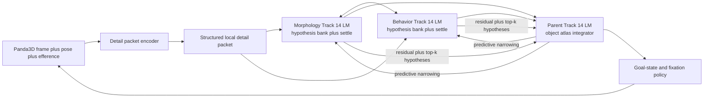

# Track 14: Biological Sensing And A New Predictive LM Family

## Goal

Define the next Monty learning-module family under five explicit constraints:

- sensors provide biologically plausible data rather than solved 3D world coordinates
- sensors preserve fine local detail rather than collapsing each observation to one coordinate plus one narrow feature bag
- the new system is implemented in PyTorch
- the system learns online on each pass without backpropagation through time or global gradient descent
- the implementation is a new LM family with a new core, not another extension of the current cluttered Torch LM modules

This track is not a replacement for Track 12 or Track 13. It is the next step
after taking both seriously.

Track 12 contributed the temporal and predictive-state discipline.
Track 13 contributed the delayed-summarization and detail-accretion lesson.
Track 14 turns those into a concrete architectural decision:

- keep the current Track 12 Torch LM family as the benchmarked baseline
- create a new predictive LM family with a new core for structured detail packets,
  bounded hypothesis banks, predictive narrowing, and local online learning

## Depends On

- [track-12-cortical-time-and-predictive-state.md](track-12-cortical-time-and-predictive-state.md)
- [track-12-benchmark-schematic-and-math.md](track-12-benchmark-schematic-and-math.md)
- [track-12-temporal-attention-compatibility-matrix.md](track-12-temporal-attention-compatibility-matrix.md)
- [track-1-multi-column-intelligence.md](track-1-multi-column-intelligence.md)
- [track-5-object-behaviors.md](track-5-object-behaviors.md)
- [track-6-predictive-coding-heterarchy.md](track-6-predictive-coding-heterarchy.md)
- [track-10-deep-heterarchy-and-biological-depth.md](track-10-deep-heterarchy-and-biological-depth.md)
- [track-11-deep-hierarchy-and-gpu-scaling.md](track-11-deep-hierarchy-and-gpu-scaling.md)
- [track-13-foveated-detail-accretion-and-live-perception.md](track-13-foveated-detail-accretion-and-live-perception.md)

Primary repo grounding for what exists now and what this track would change:

- [sensor_modules.py](../src/tbp/monty/frameworks/models/sensor_modules.py)
- [change_detecting_sm.py](../src/tbp/monty/frameworks/models/change_detecting_sm.py)
- [learning_module.py](../src/tbp/monty/frameworks/models/cortical_column_torch/learning_module.py)
- [column.py](../src/tbp/monty/frameworks/models/cortical_column_torch/column.py)
- [experiment.py](../src/tbp/monty/frameworks/models/cortical_column_torch/experiment.py)
- [encoders.py](../src/tbp/monty/frameworks/models/cortical_column_torch/encoders.py)
- [location_feature_memory.py](../src/tbp/monty/frameworks/models/cortical_column_torch/location_feature_memory.py)
- [reference_frame_estimator.py](../src/tbp/monty/frameworks/models/cortical_column_torch/reference_frame_estimator.py)

## Scientific Anchors

The mathematical direction in this note is constrained by a small set of
canonical results rather than by the current repo implementation.

- Rao and Ballard (1999), predictive coding in visual cortex: cortical computation should be expressed as top-down prediction plus bottom-up error.
- Friston (2005), cortical responses and free-energy style inference: hierarchical cortical inference is naturally written as prediction-error minimization over latent causes.
- Andersen and Cui (2009), intentional maps and gain fields in posterior parietal cortex: coordinate transforms should be learned and state-dependent, not hard-coded world-coordinate outputs from the sensor front end.
- Sommer and Wurtz (2008), efference copy and predictive remapping: action context should shape the next sensory prediction before new input arrives.
- Hafting et al. (2005), grid-cell path integration: internal location coding is plausibly represented as a periodic latent code rather than direct metric XYZ supplied by the sensor.
- O'Keefe and Recce (1993), phase precession and multiplexed time: temporal progression can be represented as recurrent state trajectories rather than a single scalar timer.
- Buonomano and Maass (2009), state-dependent cortical computation: timing is most plausibly carried by distributed recurrent state, not only by explicit symbolic clocks.
- Stachenfeld, Botvinick, and Gershman (2017), hippocampal predictive maps: spatial memory is best understood as predictive latent structure rather than passive coordinate storage.

## Problem

The current repo has two different problems that interact badly.

First, the sensor front end still over-solves the geometry problem and still
throws away too much local structure.

In effect, the current path often looks like:

$$
\text{raw sensory frame} \rightarrow \text{3D world-coordinate patch center}
\rightarrow \text{LM state}
$$

and, just as importantly, often like this:

$$
\text{raw sensory frame} \rightarrow
\big(\text{one coordinate} + \text{one narrow feature bag}\big)
\rightarrow \text{LM}
$$

That gives the LM too much solved geometry for free while also discarding much
of the fine local structure that real cortical columns exploit.

Second, the current Torch LM modules are carrying too many roles at once.

The present family mixes:

- compatibility plumbing for the old LearningModule interface
- one-state encoding and settling
- temporal traces and optional temporal memories
- voting and hierarchy output
- context handling
- goal-state generation
- inferred-state correction
- benchmark and logger-facing bookkeeping

That is already too much. The Track 14 proposal adds structured detail packets,
explicit bounded hypothesis banks, predictive narrowing, residual messages, and
surface-atlas memory. Forcing that into the current LM family would increase
complexity while still leaving the wrong computational core in place.

## Main Claim

Track 14 should introduce a new LM family with a new core while keeping the
current Track 12 Torch LM family frozen as a benchmarked baseline.

The new family should be built around:

- structured local detail packets rather than one collapsed state
- an explicit bounded hypothesis bank rather than only one settled summary
- predictive and residual inter-LM messages rather than only context broadcast
- local object-surface atlas memory rather than sensor-front-end-solved geometry
- online local learning rules rather than backpropagation-through-time

The current `CorticalColumnTorchLM` should remain available for comparison,
regression testing, and benchmark continuity. It should not be the primary
implementation vehicle for Track 14.

## Section 1: Sensory Contract

### What The Sensor Should Emit

Let the LM-facing sensory packet be:

$$
Y_t = \big(\mathcal{S}_t, p_t, u_{t-1}\big),
\qquad
\mathcal{S}_t = \{s_t^{(1)}, \dots, s_t^{(J_t)}\}
$$

where $\mathcal{S}_t$ is a small structured bundle of local detail shards,
not one center point. Each shard can be written as:

$$
s_t^{(j)} = \big(a_t^{(j)}, g_t^{(j)}, m_t^{(j)}, \omega_t^{(j)}\big)
$$

where:

- $a_t^{(j)}$ = local appearance descriptor, such as color moments, oriented edge energy, local frequency or texture responses, curvature summaries, or a compact learned local embedding
- $g_t^{(j)}$ = local support geometry, such as receptive-field offset, scale, orientation, support mask, and overlap relations to neighboring shards
- $m_t^{(j)}$ = local motion or temporal cue, such as optic-flow snippets, feature deltas, disparity, or depth proxy
- $\omega_t^{(j)}$ = uncertainty and provenance, such as confidence, timestamp, modality tag, and on-object probability
- $p_t$ = body-relative sensor pose, such as gaze, camera, whisker, or hand pose
- $u_{t-1}$ = efference copy of the previously executed action

For the rest of this note, $y_t$ means a tensorized encoding of $Y_t$, not a
single coordinate plus a few scalars.

This deliberately excludes:

- allocentric world coordinates
- object-centered coordinates
- object identity
- solved rigid transforms

### Not Full Track 13, But No Early Collapse Either

Track 14 does not require the full Track 13 live multi-crop stack. But it does
require importing Track 13's strongest sensory lesson:

$$
O_t \rightarrow \mathcal{S}_t \rightarrow y_t \rightarrow \text{LM}
$$

is acceptable, while:

$$
O_t \rightarrow (\ell_t, f_t) \rightarrow \text{LM}
$$

is too compressed.

The minimal commitment is therefore:

- each LM receives a structured local detail packet, not just one location plus a tiny feature vector
- the sensory packet preserves enough local structure to support texture, micro-geometry, and ambiguous local alignments
- summarization happens after local detail extraction, not before it

## Section 2: Fast Latent State And Hypothesis Bank

Define the fast inferential state as:

$$
x_t = \big(o_t, q_t, T_t, b_t\big)
$$

where:

- $o_t$ = posterior over object identity
- $q_t$ = posterior over local surface chart or object-surface coordinate
- $T_t \in SE(3)$ = posterior body-to-object transform
- $b_t$ = posterior over behavior or dynamical mode

Track 14 should also explicitly keep a bounded hypothesis list:

$$
\mathcal{H}_t = \{(\xi_t^{(k)}, w_t^{(k)})\}_{k=1}^{K_t},
\qquad
\xi_t^{(k)} = \big(o_t^{(k)}, q_t^{(k)}, T_t^{(k)}, b_t^{(k)}\big)
$$

where $\mathcal{H}_t$ is the active hypothesis bank and $w_t^{(k)}$ are
normalized weights.

The settled state $x_t$ is not the same thing as the hypothesis bank. It is a
compact summary extracted from it:

$$
x_t = S\big(\mathcal{H}_t, y_t, d_{t-1}, c_t\big)
$$

This is the cleanest augmentation of original Monty ideas:

- keep explicit hypotheses
- let evidence and prediction reshape them online
- keep the settled state as a compact working summary rather than pretending a single vector replaced the hypothesis list

The bank should stay bounded and dynamic rather than exhaustive:

- keep top-$K$ active hypotheses
- prune persistently weak hypotheses
- spawn offspring around high-probability regions
- add observation-driven burst hypotheses when the current bank stops matching

## Section 3: Temporal State

Define the slower online temporal context as:

$$
d_t = \big(\tau_t, \rho_t, \beta_t, m_t\big)
$$

where:

- $\tau_t$ = distributed multi-timescale recurrent temporal trace
- $\rho_t$ = dwell or progression state within the current regime
- $\beta_t$ = boundary pressure
- $m_t$ = slow predictive memory anchor for the current object-regime context

This preserves the core Track 12 claim that one primary online temporal state
exists, but it makes that state more biologically plausible.

### What Track 14 Should Retain From Track 12 Here

Track 14 should explicitly preserve the strongest Track 12 temporal
commitments.

1. The primary online mechanistic state should still be understood as
    $h_t = (x_t, d_t)$.
    In Track 14, $x_t$ is the fast settled summary of the active hypothesis bank
    rather than a single compact attractor vector, but it still plays the role
    of current inferential state.
2. $d_t$ should remain a bank of distributed multi-timescale traces rather than
    collapsing into a symbolic timer, phase label, or discrete behavior state.
3. Action-conditioned prediction and efference copy should enter predictive
    advance and temporal update directly. They are not optional diagnostics.
4. Boundary pressure should remain an explicit derived variable used for
    re-anchoring, burst insertion, message gating, and reporting rather than a
    hidden loss.

Track 14 should also preserve Track 12's separation between:

- online temporal state used for inference now
- derived predictive and gating signals
- slower plasticity traces used for learning

Older timing surrogates such as global interval timers, explicit semi-Markov
state owners, or phase-decoding summaries may still be useful as comparison
baselines or auxiliary readouts. They should not become the primary online
state of the Track 14 core.

## Section 4: Object Memory As A Surface Atlas

The right 3D memory is not a full mesh and not a raw point cloud cache.

For each object $o$, define:

$$
M_o = \big(\mathcal{A}_o, \Psi_o, \Pi_o\big)
$$

where:

- $\mathcal{A}_o$ = a set of local surface charts
- $\Psi_o$ = sensory generators or prototypes attached to those charts
- $\Pi_o$ = transition structure over charts and behavior modes

Each local chart can be written as:

$$
a_i = \big(\mu_i, \Sigma_i, q_i, \nu_i, \kappa_i\big)
$$

where:

- $\mu_i$ = expected local sensory patch statistics
- $\Sigma_i$ = uncertainty or variability of that patch
- $q_i$ = chart coordinate on the object surface
- $\nu_i$ = local pose or normal basis summary
- $\kappa_i$ = local geometric or appearance descriptor summary

This representation supports:

- 3D object structure
- viewpoint variation
- behavior-conditioned local dynamics
- online incremental learning

## Section 5: Gain-Field Coordinate Transform

The body-centric to object-centric transform should be modeled internally via
gain-like interactions rather than direct metric injection.

One useful first-pass formulation is:

$$
z_t^{\mathrm{ego}} = W_e\big(\phi_r(r_t) \odot \phi_p(p_t)\big)
$$

$$
z_t^{\mathrm{obj}} = W_o\big(z_t^{\mathrm{ego}} \odot \phi_o(o_t)\big)
$$

where:

- $\phi_r$ encodes sensory packet content
- $\phi_p$ encodes body-relative pose
- $\phi_o$ encodes the current object hypothesis
- $\odot$ is multiplicative gain modulation

## Section 6: Generative Model And Predictive Advance

The per-step sensory prediction should be written as:

$$
\hat y_t = G\big(o_t, q_t, T_t, b_t, p_t, u_{t-1}\big)
$$

The system should also predict the next plausible hypothesis bank:

$$
\hat{\mathcal{H}}_{t|t-1} = F\big(\mathcal{H}_{t-1}, d_{t-1}, u_{t-1}, c_t\big)
$$

Track 14 is only genuinely predictive if it predicts both:

- what the next local detail packet should look like
- which object, chart, pose, and behavior hypotheses should still be plausible

## Section 7: Inference Dynamics

### Per-Step Energy

Define a local inference objective:

$$
\mathcal{E}_t =
\|y_t - \hat y_t\|_{\Sigma_y^{-1}}^2
+ \lambda_T d_{SE(3)}\!\left(T_t, \hat T_{t|t-1}\right)^2
+ \lambda_q d_{\mathcal{A}}\!\left(q_t, \hat q_{t|t-1}\right)^2
+ \lambda_b \, \mathrm{KL}\!\left(q(b_t) \,\|\, p(b_t \mid d_{t-1})\right)
+ \lambda_m \|\phi(x_t) - m_{t-1}\|^2
$$

This objective is not meant to be backpropagated through many timesteps. It is
the energy minimized locally inside each inference pass.

### Settle Loop

Initialize the current pass from previous state and action context:

$$
x_t^{(0)} = A_x x_{t-1} + B_d d_{t-1} + B_u u_{t-1} + B_c c_t
$$

Then run a small fixed number of local settle iterations:

$$
\hat y_t^{(k)} = G\big(x_t^{(k)}, p_t, u_{t-1}\big)
$$

$$
e_t^{(k)} = y_t - \hat y_t^{(k)}
$$

$$
x_t^{(k+1)} = \operatorname{sparsify}\Big(
x_t^{(k)} + \eta_y W_y^\top e_t^{(k)} + \eta_d W_d d_{t-1} + \eta_c W_c c_t
\Big)
$$

and update the transform block explicitly:

$$
T_t^{(k+1)} = \exp\!\big(\eta_T \, \xi_t^{(k)}\big) T_t^{(k)}
$$

where $\xi_t^{(k)}$ is the local pose-correction signal.

### Hypothesis Weight Update And Resampling

For each active hypothesis $\xi_t^{(k)}$, define a local energy
$\mathcal{E}_t^{(k)}$ and update weights as:

$$
\tilde w_t^{(k)} \propto w_{t|t-1}^{(k)} \exp\!\big(-\mathcal{E}_t^{(k)}\big)
$$

Then maintain the active bank by:

$$
\mathcal{H}_t = \operatorname{topK}\Big(
\operatorname{prune}\big(
\hat{\mathcal{H}}_{t|t-1}
\cup \mathcal{H}_t^{\mathrm{obs}}
\cup \mathcal{H}_t^{\mathrm{offspring}}
\big)
\Big)
$$

where:

- $\hat{\mathcal{H}}_{t|t-1}$ = predictively advanced old hypotheses
- $\mathcal{H}_t^{\mathrm{obs}}$ = observation-driven new hypotheses
- $\mathcal{H}_t^{\mathrm{offspring}}$ = refined variants near current strong hypotheses

## Section 8: Boundary Pressure, Behavior, And Learning

After settlement, define post-settle mismatch and discontinuity:

$$
\epsilon_t = \|y_t - \hat y_t\|
$$

$$
\Delta_q = d_{\mathcal{A}}\!\left(q_t, \hat q_{t|t-1}\right),
\qquad
\Delta_T = d_{SE(3)}\!\left(T_t, \hat T_{t|t-1}\right)
$$

Then boundary pressure becomes:

$$
\beta_t = \sigma\!\left(
w_\epsilon \epsilon_t + w_q \Delta_q + w_T \Delta_T - \theta_\beta
\right)
$$

Update temporal context as:

$$
\tau_t = (1 - \beta_t) A_\tau \tau_{t-1} + B_\tau \phi(x_t) + C_\tau u_t
$$

$$
\rho_t = (1 - \beta_t)(\rho_{t-1} + 1) + \beta_t,
\qquad
m_t = (1 - \eta_m) m_{t-1} + \eta_m \phi(x_t)
$$

Behavior state remains explicit enough to support articulated or dynamic
objects, but remains a derived inferential state rather than a supervised label.

Every sensory pass should produce both:

- local inference updates
- local memory updates

No global gradient over a long rollout is required.

## Section 9: New LM Family With New Core

### The Architectural Decision

Track 14 should create a new LM family, not another configuration of the
current Torch LM family.

The current family should remain as a legacy baseline:

- `CorticalColumnTorchLM` remains the Track 12 benchmark vehicle
- its current core remains valid for comparisons and regressions
- Track 14 should not be implemented as another layer of flags on top of it

### Why A New Family Is Required

The new design has a different computational object.

The current Torch column core is fundamentally a one-state-in,
one-encoding, one-settled-attractor, per-object-evidence pipeline.

Track 14 instead requires:

- structured sensory packets
- explicit top-$K$ hypothesis banks
- predictive advance of those hypotheses
- pruning, offspring, and burst insertion
- local atlas memory
- predictive and residual messages between LMs

That is not a small extension. It is a new core.

### Recommended Family Shape

The new family should have one public LM adapter and several internal modules.

Suggested shape:

- `PredictiveHypothesisTorchLM`: LearningModule-compatible adapter
- `PredictiveHypothesisCore`: the actual inference and learning core
- `DetailPacketEncoder`: converts sensor output into structured local packet tensors
- `HypothesisBank`: maintains top-$K$, pruning, offspring, and burst hypotheses
- `AtlasMemory`: object-surface chart memory and local generators
- `PredictiveMessageState`: packages lateral compatibility, upward residual, and downward predictive messages

The morphology child LM, behavior child LM, and parent LM should all come from
this family, but use different packet encoders, priors, and memory settings.

The point is not one custom LM per role. The point is one new family with one
new core and role-specific specializations.

## Section 10: Torch Implementation Without Autograd-Based Learning

The no-backprop constraint does not weaken the case for PyTorch. It mainly
changes how PyTorch is used.

### What Torch Is For

Torch should be used for:

- batched tensor storage of latent states, traces, and object memories
- batched top-$K$ hypothesis banks storing object, chart, pose, behavior, and weight
- detail-shard buffers and patch-level descriptor tensors
- fast matrix multiplies for inference and prediction
- `softmax`, `topk`, `matmul`, `index_add_`, `scatter_add_`, and batched linear algebra
- GPU execution of settle loops and local update rules

### What Torch Is Not For Here

Torch should not be used primarily for:

- `loss.backward()` through long sensory sequences
- optimizer-driven end-to-end representation learning as the main Track 14 mechanism
- training the temporal core by backpropagation through time

### Practical Torch Form

The implementation pattern should be:

```python
with torch.no_grad():
    detail_packet = encode_detail_packet(sensor_packet)
    H = predict_hypothesis_bank(H_prev, d_prev, action_ctx, context)

    for _ in range(n_settle_iters):
        y_hat = generator(H, pose_ctx)
        error = detail_packet - y_hat
        H = local_hypothesis_update(H, error, d_prev, context)
        H = prune_and_spawn(H, error, detail_packet)
        x = settle_summary(H)
        x = sparsify(x)

    beta = boundary_pressure(error, H, H_prev)
    d = temporal_update(d_prev, x, action_ctx, beta)
    local_memory_update(memories, H, detail_packet, error, beta)
```

This is completely compatible with Torch while preserving online local
plasticity.

### Torch Must Not Be A Dict Wrapper

Using Torch as a thin shell around Python dict plumbing is not the intended
scientific abstraction.

The correct boundary is:

- Python dicts are acceptable at the simulator and adapter boundary
- after that boundary, the inferential core should operate on a small set of
    typed tensor objects

If the implementation still passes ad hoc dict packets throughout the core,
then Torch is serving as a convenience library rather than as the language of
the model.

### Core Tensor-Native Scientific Objects

The cleaner Track 14 target is to define three tensor-native objects and make
the core about them.

#### 1. Observation field

The sensory object should be a tensor field rather than a bag of Python keys:

$$
X_t =
\Big(
X_t^{rgb},
X_t^{depth},
X_t^{sup},
X_t^{xyz},
X_t^{flow},
u_{t-1}
\Big)
$$

with a retinotopic patch structure such as:

$$
X_t^{rgb} \in [0,1]^{G_h \times G_w \times P_h \times P_w \times 3}
$$

$$
X_t^{depth}, X_t^{sup} \in \mathbb{R}^{G_h \times G_w \times P_h \times P_w}
$$

$$
X_t^{xyz} \in \mathbb{R}^{G_h \times G_w \times P_h \times P_w \times 3}
$$

$$
X_t^{flow} \in \mathbb{R}^{G_h \times G_w \times d_f}
$$

The critical point is that these tensors should remain in sensor or body frame.
Allocentric world pose should not be supplied as a solved sensor output.

#### 2. Stream-specific observation embeddings

The child pathways should not read the same sensory field through one generic
encoder. They should compute different observation embeddings:

$$
z_t^{app} = E_{app}(X_t^{rgb}, X_t^{depth}, X_t^{sup}, X_t^{xyz})
$$

$$
z_t^{chg} = E_{chg}(X_t^{flow}, \Delta X_t, u_{t-1})
$$

These do not need end-to-end backpropagation. They can be built from local,
Torch-native operators such as filter banks, support-weighted pooling,
contrast-normalized moments, motion-energy terms, and later local Hebbian
dictionary updates.

#### 3. Memory slots and hypothesis bank

Track 14 should use a modern Hopfield mechanism, but not as a label for the
entire architecture. The scientifically clean role of Hopfield-style retrieval
is associative lookup over object-chart memory slots.

Let the appearance and change memories be:

$$
K^{app}, V^{app} \in \mathbb{R}^{M \times D_{app}},
\qquad
K^{chg}, V^{chg} \in \mathbb{R}^{M \times D_{chg}}
$$

with retrieval:

$$
r_t^{app} = {V^{app}}^\top \, \mathrm{softmax}(\beta K^{app} z_t^{app})
$$

$$
r_t^{chg} = {V^{chg}}^\top \, \mathrm{softmax}(\beta K^{chg} z_t^{chg})
$$

The active inferential object should then be an explicit sparse hypothesis bank:

$$
H_t = \{(o_k, q_k, \pi_k, w_k)\}_{k=1}^{K}
$$

where:

- $o_k$ = object identity hypothesis
- $q_k$ = local chart or surface-state hypothesis
- $\pi_k$ = sensor-relative pose or alignment code
- $w_k$ = normalized hypothesis weight

One useful scoring form is:

$$
s_{t,k}
=
\alpha \langle z_t^{app}, K_k^{app} \rangle
+
\gamma \langle z_t^{chg}, K_k^{chg} \rangle
+
\eta \, \phi(d_{t-1}, u_{t-1}, k)
$$

followed by a sparse posterior update:

$$
w_t = \mathrm{TopKSoftmax}(s_t)
$$

This makes the scientific objects explicit:

- the observation field is tensor-native
- the streams are role-specific
- Hopfield retrieval is the associative-memory operator
- the hypothesis bank is the main inferential object

#### Predictive residual update

The predictive part should then be written as a residual update over these
objects rather than as a collection of disconnected heuristics.

Define a predicted next embedding:

$$
\hat z_t = P(H_{t-1}, d_{t-1}, u_{t-1}, c_t)
$$

and a boundary-style instability score:

$$
\beta_t = \sigma\Big(
c_1 \|z_t - \hat z_t\|
+
c_2 (1 - \max_k w_{t,k})
-
\theta_\beta
\Big)
$$

The scientific point is that Track 14 should be composed from:

- tensor observation fields
- stream-specific local encoders
- associative Hopfield retrieval
- sparse hypothesis maintenance
- predictive residual correction
- temporal dynamical state

rather than from dict packets threaded through a monolithic core.

#### Implementation plan for modern Hopfield introduction

The concrete implementation path for Track 14 should be phased rather than
treated as one giant rewrite.

Phase 1. Shared Hopfield retrieval over chart slots.

- Replace score-only memory lookup with a settle-and-retrieve operator over one
    shared slot bank.
- Keep object tags and chart tags on slots so object evidence can still be
    aggregated without per-object memories.
- Expose retrieval state explicitly: settled query, slot attention, best chart,
    energy trace, and iteration count.
- Preserve the current LM and benchmark APIs while this associative operator is
    introduced.

Phase 2. Chart-aware hypothesis maintenance.

- Upgrade the hypothesis bank from object-only evidence to object plus chart
    plus pose hypotheses.
- Let memory return attended chart evidence and let the hypothesis bank remain
    the inferential state that chooses object identity.
- Keep voting and context messages object-centric until the chart-aware path is
    stable locally.

Phase 3. Split associative memories by role.

- Separate appearance-memory retrieval from change-memory retrieval.
- Compose the query from sensory evidence plus temporal trace plus action
    context before retrieval rather than only reweighting scores afterward.
- Maintain a fused parent-level hypothesis bank over child retrieval states.

Phase 4. Predictive residual and capacity benchmarks.

- Evaluate boundary pressure, surprise, and recovery as functions of retrieval
    mismatch rather than only raw embedding mismatch.
- Add chart-capacity and partial-cue completion benchmarks to verify the memory
    behaves like a modern Hopfield-style associative system instead of a prototype
    table.
- Explicitly test against dominant-attractor collapse in shared-memory
    multi-object settings.

Current implementation slice.

- This patch lands Phase 1 end to end, begins Phase 2, and now starts Phase 3.
- Track 14 now uses shared Hopfield-style settling over chart-tagged slots in
    the predictive-hypothesis memory path.
- Retrieval state is first-class and exposed in diagnostics.
- The hypothesis bank remains backward compatible for Monty but now carries the
    winning chart id alongside each object hypothesis.
- The core now keeps separate appearance-memory and change-memory retrieval
    paths, with stream-specific query shaping from sensory evidence, temporal
    trace, and action context before conservative object-level score fusion.
- The learning path now also has novelty-gated slot creation, count-adaptive
    prototype consolidation, persistent chart-transition counts across
    episodes, and persistent latent object IDs that can be reused across
    episodes by memory similarity.
- Supervised object labels are no longer injected into the Track 14 learning
    core as direct learning identities. The core now learns under raw latent
    object IDs only.
- During labeled benchmark training episodes, the core receives only an
    episode-level continuity anchor, not the external object label itself.
    This lets one labeled episode keep continuity over one latent without
    turning the external label into the learned identity.
- External labels now live at the LM reporting boundary and in benchmark-side
    decoders rather than inside core inference and LM-to-LM identity
    resolution.
- Upward LM outputs can still carry raw latent graph IDs where the hierarchy
    needs a stable unsupervised child signature, but downward context remains
    activity-first and lateral voting now depends on typed vote messages with
    `active_cells` preserved through the Monty vote combiner.

Current benchmark-facing status.

| Surface | Models / setting | Current result | Key numbers | Main note |
|---|---|---|---|---|
| Focused Track 14 units | Sensor/core typed-message suite | Green in validated env | `25 / 25` passed with `/opt/miniconda3/envs/tbp.monty/bin/python` and `PYTHONPATH=src` | The dedicated Track 14 package is real and locally stable, though still narrower than repository-wide acceptance. |
| Hierarchical Monty smoke | Real-asset `fox -> robot -> eval(robot)` | Green | `2 / 2` passed | Full Panda3D Monty hierarchy still runs end to end after the latent-only refactor. |
| Pairwise falsifier | `fox`, `robot` | Green on targeted rerun | primary matched / resolved / strict = `1.0 / 1.0 / 1.0`; behavior = `1.0`; morphology and parent can fall to `0.5` while final identity stays correct | Acceptance for this slice is resolved final identity, not every auxiliary child path. |
| Pairwise falsifier | `fox`, `cesiumman` | Green on targeted rerun | primary matched / resolved / strict = `1.0 / 1.0 / 1.0`; behavior = `1.0`; morphology can fall to `0.5`; perturbation deltas can drift slightly negative | Behavior and joint child signatures remain sufficient to resolve identity. |
| Three-model falsifier | `fox`, `cesiumman`, `robot` | Green on targeted rerun | primary matched / resolved / strict = `1.0 / 1.0 / 1.0`; behavior = `1.0`; morphology is around `0.667`; parent aggregate can rerun below `1.0` | Final predictions are now correct and resolved, but not every raw child or parent path stays perfect. |
| Targeted heavy real-asset smokes | Track 14 single/pairwise/triad subset | Green | `4 / 4` passed after aligning stale assertions with the resolved-primary contract | These tests now guard the repaired end-to-end contract instead of auxiliary-path perfection. |
| Repository-wide pytest suite | full repo `pytest -q` | Red | `1678 passed / 53 failed / 81 errors / 9 skipped` in `103.09s` on 2026-04-11 | The repo is not green overall; current failures/errors cluster in temporal-priming plus broader Panda3D simulator/behavior/evaluation surfaces outside the narrow repaired Track 14 falsifier slice. |
| Diagnostic harness | Pairwise / triad real-asset diagnostics | Useful secondary coverage | replay support and child-only pairwise reports run, but repository-wide pytest remains red | Helpful for localization, but not sufficient as a release gate. |

#### Reading the new chart-aware diagnostics

The Track 12 falsifier report now exposes chart-competition and chart-stability
metrics at three levels: the top-level benchmark aggregate, child-only pairwise
diagnostics, and parent replay-versus-live comparisons.

These are intentionally **not** chart-correctness metrics. The current
benchmark path does not carry a defensible ground-truth chart label, so the new
fields should be read as answers to:

- whether the winning latent kept multiple chart candidates alive
- whether the winning chart resolved to one chart at each step
- how often the winning chart switched over time
- whether ranked context or vote priors actually pushed the winning chart
- how concentrated the episode stayed on one dominant chart

The most useful fields are:

| Field | Interpretation |
|---|---|
| `matched_joint_hypothesis_candidate_fraction_mean` | Fraction of matched evaluation steps where joint chart candidates were exposed at all. |
| `matched_joint_top_chart_resolved_fraction_mean` | Fraction of matched steps where one top chart was actually resolved. |
| `matched_joint_top_latent_multi_chart_fraction_mean` | Fraction of matched steps where the winning latent still had multiple chart candidates in competition. |
| `matched_joint_chart_switch_fraction_mean` | Fraction of opportunities where the winning chart changed from one step to the next. |
| `matched_joint_same_latent_chart_switch_fraction_mean` | Fraction of opportunities where the chart changed while the winning latent stayed the same. |
| `matched_joint_top_context_ranked_chart_prior_fraction_mean` | Fraction of matched steps where ranked context prior mass landed on the winning chart. |
| `matched_joint_top_vote_ranked_chart_prior_fraction_mean` | Fraction of matched steps where ranked vote prior mass landed on the winning chart. |
| `matched_joint_dominant_chart_fraction_mean` | Share of matched steps claimed by the single most frequent winning chart for that episode. |

On the lightweight `fox` plus `robot` diagnostic-harness slice that now passes
in the validated environment, the aggregate readout was:

- candidate coverage = `1.0`
- resolved top-chart fraction = `1.0`
- winning-latent multi-chart fraction = `1.0`
- chart-switch fraction = `1.0`
- same-latent chart-switch fraction = `1.0`
- dominant-chart fraction = about `0.36`
- top-context-ranked-chart-prior fraction = `0.0`
- top-vote-ranked-chart-prior fraction = `0.0`

That pattern means the new reporting is seeing real chart competition rather
than a degenerate one-chart trace: the winning latent keeps multiple chart
candidates alive, the winning chart changes frequently, and no single chart
monopolizes the episode. In the same run, child-only pairwise diagnostics made
the division of labor visible: behavior remained highly multi-chart and
volatile, while morphology was mostly single-chart and much more stable.

That `fox` plus `robot` slice should still be read as one representative run,
not as the whole boundary of the feature. Broader fully self-supervised reruns
now show that ranked chart priors can activate in practice once chart ids are
preserved through combined lateral votes. In the current small self-supervised
pair, vote-ranked chart priors become active on many matched steps even when
they do not win the top chart; in the current self-supervised triad, the
winning-chart vote-prior fraction also becomes nonzero. So the right reading is:
default lightweight runs may still show `0.0` on the top-vote fraction, but the
mechanism is live and observable in the broader self-supervised benchmark path.

The replay diagnostics should be read as a reproducibility check on those same
chart statistics. In the same `fox` plus `robot` slice, the parent replay kept
the final prediction aligned with live execution and all new chart deltas were
`0.0` except a small same-latent chart-switch drift on `robot`
of about `-0.037`. That is the right current standard: near-zero replay drift
on the chart-competition metrics, not a fabricated notion of "correct chart".

Even with the targeted falsifier now green on resolved-primary metrics, live
same-seed probing still exposed a simulator-side issue that matters: running one animated asset before another in
the same Python process can change the later action trace even when the Track 14
core state is reloaded deterministically. The strongest current evidence points
to Panda3D animated-actor lifecycle and camera-initialization instability,
including occasional pathological posed bounds, so the current benchmark retry
logic is a containment measure rather than a full reproducibility fix.

#### Readiness level by feature

For planning purposes, it helps to separate "implemented somewhere" from
"ready as a dependable Track 14 capability".

Use the following readiness levels:

- Level 4 = ready and validated for the intended Track 14 slice
- Level 3 = implemented and useful, but still scope-limited or materially heuristic
- Level 2 = prototype path with clear value, but not yet a strong scientific or runtime closure
- Level 1 = mostly design target, not yet a live Track 14 capability

On that scale, Track 14 is currently **Level 3 overall**: it is a real and
usable research slice with green focused tests, green real-asset hierarchy
smokes, and green targeted falsifier reruns, but it is still short of the full
Track 14 theory and still not ready as a repo-wide release-quality subsystem.

| Feature area | Readiness level | Current status summary |
|---|---|---|
| New LM family and new core | Level 4 | `PredictiveHypothesisTorchLM` and `PredictiveHypothesisCore` are real, separate from the older Track 12 family, and live in focused unit and integration tests. |
| Typed tensor-native objects and LM boundary contract | Level 4 | `ObservationField`, typed vote/context messages, temporal state, and tensor-native retrieval state are implemented and exercised end to end. |
| Hierarchical Monty integration | Level 4 | The three-LM morphology/behavior/parent stack runs against real Panda3D-rendered assets and survives the latent-only refactor. |
| Structured sensory contract | Level 3 | Track 14 really consumes structured detail packets rather than one collapsed state, but the packet encoder is still mostly engineered pooling and summaries. |
| Temporal state and Track 12-style temporal discipline | Level 3 | Multi-timescale traces, dwell, surprise, and boundary-style diagnostics are real, but still simpler than the full temporal theory the document argues for. |
| Stream-specific pathways | Level 3 | Separate appearance and change pathways and memories are real, but stream fusion is still heuristic and parent reasoning over streams is not yet first-class. |
| Hopfield-style / sparse recurrent associative memory | Level 3 | The memory path is real and useful, but still closer to an explicit slot-and-prototype system than to a full surface-atlas latent memory architecture. |
| Hypothesis bank | Level 3 | There is a bounded ranked bank with chart metadata, but it is still mostly object-ranked rather than a sparse posterior over object, chart, pose, and behavior. |
| Online local learning | Level 3 | Novelty-gated slot creation, consolidation, chart-transition counts, and cross-episode reuse are implemented, but the learning rule is still heuristic rather than a stronger predictive plasticity system. |
| Latent object identity | Level 3 | The core now learns under persistent latent IDs and pushes external labels to reporting boundaries, but latent continuity is still stabilized by heuristic matching. |
| Predictive coding loop | Level 2 | The core predicts next embeddings and uses mismatch as a signal, but it does not yet predict the next observation field or route clean residual messages through the hierarchy. |
| Predictive inter-LM communication | Level 2 | Typed messages are real, but true parent-to-child predictive priors and surprise-gated upward residuals are not yet the main architecture. |
| Runtime hardening and release discipline | Level 2 | The narrow validated slice is stable, but the path still depends on containment work for Panda3D lifecycle issues and platform-specific threading constraints. |
| Surface-atlas, chart-pose-behavior latent model | Level 1 | The current code has pieces of this story, but not yet the full latent state the Track 14 theory claims. |
| Laminar / dendritic Track 10 recasting | Level 1 | The runtime is not yet a laminar cortical column; the biological mapping remains mostly conceptual. |
| Batched cortical-area scaling | Level 1 | Track 14 is tensor-native internally, but still runs through Python-level LM orchestration rather than a batched Track 11-style hierarchy backend. |

#### Honest implementation gap table

The table below is intentionally critical. It distinguishes what the current
Track 14 code actually does from what the full Track 14 theory claims.

| Capability | Current Track 14 implementation | Honest status | Main gap to the stated target | Best immediate next move |
|---|---|---|---|---|
| Structured sensory contract | The LM now consumes `ObservationField` tensors built from detail packets and no longer relies only on one collapsed sensor state. | Partial and real | The encoder is still mostly hand-engineered pooling and summary statistics, not a learned local cortical-style feature substrate. | Replace more of `DetailPacketEncoder` with local reusable patch dictionaries / Hebbian feature banks while keeping the tensor-native observation field boundary. |
| Stream-specific pathways | Separate appearance, geometry, and temporal embeddings exist, and Track 14 now retrieves from separate appearance and change memories. | Partial and real | The streams are still fused heuristically, and the parent does not yet reason over child stream states as first-class latent variables. | Promote stream states into the hypothesis bank and parent integration path rather than only fusing object scores late. |
| Hopfield-style associative memory | `AtlasMemory` performs iterative settle-and-retrieve over shared slots with energy traces, chart tags, and object-tagged aggregation. | Partial and real | This is a modern-Hopfield-like operator, but it is still explicit prototype-slot memory, not the whole architecture, and identity remains query-anchored by design. | Keep the Hopfield operator, but move chart / pose / behavior inference into the hypothesis bank so retrieval does not need to carry identity semantics by itself. |
| Hypothesis bank | There is a bounded hypothesis bank with ranked object hypotheses and chart metadata. | Partial | The bank is still mostly object-ranked. It is not yet a true sparse posterior over object, chart, pose, and behavior. | Upgrade the bank to explicit `(object, chart, pose, behavior, weight)` hypotheses and make bank maintenance the main inference object. |
| Learning rule | Learning is online and local: sensory queries are written into associative-memory slots with novelty-gated slot creation, count-adaptive consolidation, persistent chart-transition counts, and cross-episode latent-memory reuse. | Partial and real | The current rule is still slot writing plus heuristic continuity matching, not full self-supervised cortical learning. It does not yet learn a generative predictive world model over chart / pose / behavior state. | Replace the current heuristic reuse and insertion logic with stronger local predictive-plasticity rules that learn chart, pose, and change dynamics directly. |
| Object identity | Track 14 now forms persistent latent object IDs, learns under those latents in the core, and keeps external labels at the LM reporting / benchmark-decoder boundary. | Partial and more general | This is a more serious reduction in supervised-ID dependence than before, but identity is still stabilized by heuristic continuity logic rather than by a full self-supervised latent-object discovery process. | Keep external labels as optional annotations only, then replace the current heuristic latent continuity rules with stronger self-supervised object / chart / pose / behavior inference. |
| Predictive coding loop | The core predicts the next embedding from temporal context and action context, then uses mismatch and confidence gaps as boundary-style signals. | Partial | There is not yet a real generative prediction of the next observation field or a clean residual message architecture. | Add explicit prediction heads for the next appearance and change embeddings, then pass residuals upward and predictive priors downward. |
| Inter-LM communication | Track 14 has typed context and vote messages, activity-first context, raw latent upward signatures where needed, and richer diagnostics than Track 12. | Partial | It still lacks true parent-to-child predictive messages and surprise-gated upward residual communication as the main architecture. | Implement predictive downward seeding and residual upward reporting before further expanding vote heuristics. |
| Laminar / dendritic biological depth | The Track 14 doc is biologically grounded and Track 10 already defines laminar, dendritic, interneuron, thalamic, and eligibility-trace mechanisms. | Mostly missing in the Track 14 core | The current Track 14 runtime is not yet a laminar cortical column. It is a new predictive LM family using a flatter functional core. | Re-express the Track 14 core in Track 10 roles: L4 observation drive, L2/3 fast hypothesis settling, basal/apical prediction bias, L5 broadcast, L6 predictive gating. |
| Scalability | Track 14 is tensor-native and PyTorch-based, and the data objects are much cleaner than the older dict-heavy path. | Partial | The Track 14 path still runs through Python-level LM orchestration rather than Track 11-style batched cortical areas and deep hierarchy execution. | Build a batched `CorticalArea` / `CorticalHierarchy` backend for Track 14 so many columns can run as tensor batches rather than as Python message loops. |
| Self-supervised generalization | The system already uses prediction, temporal continuity, action context, perturbation falsifiers, and benchmark-side latent decoders. | Partial | The core is no longer trained on supervised object IDs, but continuity and decoder fitting are still heuristic and benchmark-shaped rather than emerging from a full predictive world model. | Shift the learning target from heuristic latent continuity and decoder support toward self-supervised predictive world-modeling over chart / pose / change continuity. |
| Evaluation discipline | Track 14 now has real Panda3D, real-asset, full-Monty falsifier coverage. | Strong | The remaining weakness is not observability or benchmarking discipline; it is that the scientific target is ahead of the current learning machinery. | Keep the current falsifiers, then add new tests for label-free identity emergence, partial-cue completion, cross-view generalization, and transfer across modalities. |

#### Best next steps toward a general cortical column

If the real target is not merely "a better object recognizer" but a more
general cortical-column-like system that is biologically grounded, scalable,
and self-supervised, then the next moves should be prioritized as follows.

1. Remove external object identity from the learning core.

The single biggest conceptual gap is still supervised object identity.
Everything else will remain partly benchmark-specific until the column learns
local sensorimotor regularities first and only maps them to object names later.

The next implementation target should therefore be:

- keep external labels only for evaluation and reporting
- learn chart, pose, and change continuity self-supervised from repeated views
- form latent object hypotheses from persistent chart-transition structure rather
    than from externally assigned object IDs

From first principles, this is the highest-leverage change because it improves:

- biological plausibility
- cross-object generalization
- transfer to new modalities
- resistance to benchmark overfitting

2. Promote the hypothesis bank to the primary inferential object.

The current code still behaves too much like "retrieve scores, then rank
objects." A general cortical column should instead maintain and refine a live
sparse hypothesis population.

The next bank should explicitly carry:

$$
H_t = \{(o_k, q_k, \pi_k, b_k, w_k)\}_{k=1}^{K}
$$

where:

- $o_k$ can eventually become latent rather than externally named
- $q_k$ is a chart or local surface state
- $\pi_k$ is a pose or alignment code
- $b_k$ is behavior or regime state
- $w_k$ is posterior weight

That change matters because once the bank is primary, Hopfield retrieval can be
used for what it is best at: associative support and pattern completion, not as
the place where the whole semantics of identity lives.

3. Add explicit predictive residual learning over observations, not just over scores.

The current Track 14 core predicts an embedding and uses mismatch and confidence
as boundary signals. That is a good start, but it is not yet a full predictive
coding loop.

The next implementation step should be:

- predict the next appearance embedding and next change embedding from the
    current hypothesis bank, temporal state, and action context
- compare prediction to actual observation-field-derived embeddings
- route the residual upward and use the prediction downward

In biological terms, this is where the architecture stops being mainly
associative classification and becomes local predictive inference.

4. Recast the Track 14 core in laminar and dendritic terms using Track 10 roles.

Track 10 already defines the right biological pieces:

- L4 as feedforward input drive
- L2/3 as fast recurrent settling
- basal dendrites as short-lag predictive/context bias
- apical dendrites as top-down modulation
- L5 as broadcast/output
- L6 as thalamic and feedback control

The best next step is not to bolt Track 10 modules onto the side. It is to map
the Track 14 functions into those roles directly:

- observation-field drive enters through an L4-like stage
- the hypothesis bank and fast associative settling live in an L2/3-like stage
- predicted next-state bias arrives through basal and apical predictive paths
- L5 emits residual / goal / hierarchy-facing outputs
- L6 controls predictive gating of the next input stream

That is the cleanest path from a specialized Track 14 LM to a more general
cortical column substrate.

5. Make scaling a first-class architectural constraint now, not later.

Track 11 is right that a serious column architecture must run as batched tensor
operations over many columns and areas. Track 14 is already more tensor-native
than the older LM paths, so this is the right time to preserve that advantage.

The next scaling move should be:

- define a batched `CorticalArea` abstraction for Track 14 hypotheses, memories,
    and temporal states
- batch retrieval, hypothesis maintenance, and message routing across many
    columns
- avoid adding new Python-level orchestration that would later have to be
    deleted for GPU scaling

This is essential both for practicality and for biological plausibility: real
cortex is many interacting columns, not one privileged expert model.

6. Switch from benchmark-supervised learning to self-supervised local plasticity.

The long-term learning rules should look more like:

- novelty-gated slot creation
- Hebbian or STDP-like strengthening on predictive dendritic pathways
- eligibility-trace consolidation when prediction is later confirmed
- homeostatic normalization so a few objects or charts do not monopolize memory

This should happen without introducing global backpropagation as the main Track
14 mechanism. If a standard deep-learning component is used anywhere, it should
be justified as a helper component, not as the replacement for the cortical
learning problem.

7. Expand the acceptance tests to match the general-column goal.

The existing falsifiers are valuable, but they still emphasize named-object
recognition. A more general cortical-column program needs additional tests for:

- self-supervised identity formation from repeated unlabeled views
- cross-view and cross-behavior generalization without object-name supervision
- partial-cue completion and chart completion
- top-down prediction helping lower-level inference
- transfer of the same column substrate to non-visual modalities

These tests should be treated as architecture-defining, not as optional future
research extras.

#### Recommended implementation order

The best concrete order from here is:

1. Self-supervised chart / pose / continuity learning without external object-ID dependence.
2. Full object-plus-chart-plus-pose-plus-behavior hypothesis bank.
3. Explicit next-embedding / next-observation prediction plus residual routing.
4. Laminarization of the Track 14 core using Track 10 roles.
5. Batched Track 14 cortical-area execution using Track 11 scaling discipline.
6. Cross-modal reuse of the same hypothesis / memory / predictive substrate.

That order is recommended because it preserves the most important invariant:

the architecture should become more general by first making its learning and
inference more local, predictive, and self-supervised, and only then making it
deeper and larger.

#### Most impactful readiness plan

If the goal is specifically to improve **Track 14 readiness** rather than only
to extend the theory, the work should be sequenced to raise both scientific
closure and practical dependability. The most impactful plan is:

| Phase | Primary goal | Why this is high leverage | Concrete deliverables | Expected readiness lift |
|---|---|---|---|---|
| 1 | Make latent self-supervised inference primary | This closes the single biggest gap between the current system and the stated Track 14 claim: the core still depends too much on heuristic continuity over latent object identity. | Remove any remaining object-ID dependence from core learning logic, upgrade the bank to explicit `(object, chart, pose, behavior, weight)` hypotheses, learn chart / pose / continuity under repeated unlabeled views, and add label-free identity-formation tests. | Moves hypothesis maintenance, learning, and latent identity from today's Level 3 ceiling toward a stronger Level 4 research slice. |
| 2 | Add explicit predictive residual learning | This is the point where Track 14 stops looking mostly like associative classification with memory support and starts behaving like predictive inference. | Predict next appearance and change embeddings from bank plus temporal state plus action context, compare prediction to actual observation-derived embeddings, route residuals upward, and feed predictive priors downward. | Moves the predictive loop from Level 2 to Level 3 and makes boundary-style signals scientifically cleaner. |
| 3 | Make hierarchical communication predictive by default | Track 14 already has typed messages, but readiness will stay limited while the hierarchy still behaves mainly like score exchange with richer payloads. | Add parent-to-child predictive seeding, make surprise-gated residual reporting the main upward path, and let the parent integrate child stream states rather than only late object scores. | Moves inter-LM communication from Level 2 to Level 3 and makes hierarchy behavior less heuristic. |
| 4 | Harden the validated runtime slice and make it the release gate | Scientific progress will still feel fragile if the validated slice depends on containment fixes that are not formalized as contract. | Centralize one-thread Track 14 startup policy for the affected runtime, keep heavy real-asset runs isolated in fresh processes where needed, continue Panda3D actor/camera hardening, and define a dedicated Track 14 CI gate around focused units plus hierarchy plus falsifier smokes. | Moves runtime discipline from Level 2 to Level 3 and makes regressions easier to localize. |
| 5 | Recast Track 14 into Track 10 roles and Track 11 scaling | This is important, but it should come after the learning and inference loop is no longer primarily heuristic. | Map Track 14 functions into L4, L2/3, L5, and L6 roles, then build a batched `CorticalArea` / `CorticalHierarchy` backend that carries Track 14 states as tensor batches rather than Python message loops. | Moves biological depth and scaling from Level 1 toward Level 2 or 3 without freezing in the current heuristic core. |

If only **one** readiness push is possible next, Phase 1 is the right choice.
It improves the largest number of weak areas at once: learning rule, latent
identity, hypothesis-bank semantics, self-supervised generalization, and the
scientific honesty of the whole Track 14 story.

Phase 1 should not be considered complete until all of the following are true:

- the core no longer needs external object identity for learning continuity
- the hypothesis bank is joint over object, chart, pose, and behavior rather
    than mostly object-ranked
- repeated unlabeled views can stabilize one latent identity over time
- the existing pairwise and triad real-asset falsifiers stay green on the
    resolved-primary contract
- new label-free identity and partial-cue completion tests are green in the
    validated environment

## Section 11: Hierarchical Mapping In Full Monty

Track 14 should always be conceived inside the full Monty architecture rather
than as an isolated LM demo.

### Morphology Child LM

Responsible for:

- local appearance, texture, and surface-structure prediction
- chart inference for relatively stable surface features
- pose-consistent local predictions

### Behavior Child LM

Responsible for:

- optic flow or temporal-change prediction
- behavior-mode inference
- dwell, progression, and rhythm-sensitive prediction

### Parent LM

Responsible for:

- object identity integration
- cross-child consistency over $(o_t, q_t, T_t, b_t)$
- stabilization of object-centered coordinates
- object-level memory selection and goal-state proposals

### Motor System And Policy

The motor system is not optional. Goal states, disambiguating fixations, and
action-conditioned prediction are part of the computational loop.

Track 14 validation should therefore always run through the full Monty stack:

- real sensor modules
- full LM hierarchy
- lateral communication
- parent integration
- goal-state or policy-driven movement

## Section 12: Inter-LM Communication In An Augmented Monty

The communication pattern should stay recognizably Monty-like, but it needs to
be stricter and more honest than the current repo reality.

### What Should Be Preserved From Original Monty

- multiple LMs remain distinct inference sites rather than collapsing into one monolith
- lateral long-range communication remains important
- parent and child roles remain different
- goal-state and hypothesis-testing behavior remain first-class

### What Is Not Good Enough In The Current Repo

- conditional and temporal voting are useful, but they are not the same thing as predictive coding
- current voting often assumes shared object IDs, which is too supervised for the long-term target
- downward context broadcast is weaker than true parent-to-child prediction
- sending raw sensory detail between LMs would be biologically implausible and computationally wasteful

### The Three Message Types

Each LM $i$ should communicate using three distinct message families.

#### Lateral compatibility messages

$$
m_{i \rightarrow j}^{\leftrightarrow} =
\big(\widetilde{\mathcal{H}}_t^{(i)}, A_{ij}, \Pi_t^{(i)}\big)
$$

Peers should exchange compatibility constraints over hypotheses, not raw detail
packets.

#### Upward residual messages

$$
m_{i \rightarrow p}^{\uparrow} =
\big(r_t^{(i)}, \widetilde{\mathcal{H}}_t^{(i)}, \Pi_t^{(i)}, g_t^{(i)}\big)
$$

If a child is predictable and confident, this message should be tiny or silent.
If a child is surprised or ambiguous, this message should become informative.

#### Downward predictive messages

$$
m_{p \rightarrow i}^{\downarrow} =
\big(\hat o_t^{(p \rightarrow i)}, \hat q_t^{(p \rightarrow i)},
\hat b_t^{(p \rightarrow i)}, \Pi_t^{(p \rightarrow i)},
\hat g_t^{(p \rightarrow i)}\big)
$$

The parent should send predictions that bias or seed the child's hypothesis
bank. It should not force a child label through by fiat.

## Section 13: Other First-Principles Requirements And Track 12/13 Connections

Several other requirements become hard constraints once the sensory contract is
made more realistic.

### Detail Memory Must Stay Separate From The Main Temporal State

Track 13 is right that detail accretion needs a memory layer for retained local
fragments. That layer should support $x_t$ and $d_t$, not replace them.

### Uncertainty Must Be First-Class

If sensory packets are richer and hypotheses are explicit, precision and
confidence can no longer be treated as logging-only diagnostics. They must
enter weighting, voting, and reset decisions.

### Off-Object And Null Evidence Must Count

A biologically plausible system should use absence and mismatch, not only
positive matches. If a hypothesis predicts texture or contact that is missing,
that should produce negative evidence and boundary pressure.

### Active Sensing Must Remain Central

Original Monty is strongest when movement is part of inference. Richer sensory
packets make this more important, not less. Goal states should request the next
most discriminative region, chart, or behavior phase.

### Continuous Inference Is Better Than Episode-Bound Inference

The bounded hypothesis bank should support pruning, bursts, and re-anchoring at
any time. This fits the newer burst-sampling direction better than a fixed
episode-initialized hypothesis set.

### Connection To Existing Track Features

- Track 12 boundary pressure should decide when both temporal context and local detail memory partially reset.
- Track 12 action-conditioned prediction should initialize the next hypothesis bank before new sensory input arrives.
- Track 13 delayed summarization should be imported at the sensory packet boundary, not by forcing the whole Track 13 live stack into Track 14.
- Track 6 predictive routing remains mostly missing in code, but this document defines the message types that would make it real later.

Track 14 should also explicitly retain several Track 12 capabilities even when
their implementation changes.

- Track 12's one-primary-carrier discipline should remain: extra timers, HSMMs,
    or decoders may be auxiliary comparisons, but not the main online state.
- Track 12's parent location-feature memory should survive at the capability
    level: Track 14 still needs partial-cue retrieval for "where should I look
    next?", but implemented over chart or atlas memory rather than solved world
    coordinates.
- Track 12's goal-state-driven motor loop with parent authority should remain
    the default first active-sensing path in the Track 14 hierarchy.
- Track 12's temporal-status, event, and boundary diagnostics should remain
    exposed readouts. A predictive system should say when it is confident,
    confused, or crossing a regime boundary.
- Track 10 biological-depth mechanisms such as laminar flow, multi-head
    dendrites, plateau memory, interneuron circuits, STDP, eligibility traces,
    and thalamic relay should be treated as later Track 14 depth extensions after
    the structured observation, hypothesis, and message core is stable.

### What Track 14 Should Not Make Core In V1

Several already-implemented Track 12-era mechanisms should remain optional
comparators rather than defining the Track 14 scientific core.

- `GlobalIntervalTimer`
- `SelfSupervisedSemiMarkovMemory`
- `SemiMarkovTransitionMemory`
- motion-grounded phase decoding as a primary objective
- decoder fallback logic as a substitute for a real hypothesis bank

## Section 14: Plausible Architecture And Mathematical Toolkit

The cleanest implementation path is a constrained architecture with explicit
roles and simple mathematics.



### Recommended Mathematical Tools

- structured local descriptors for texture, curvature, flow, and support masks
- explicit top-$K$ hypothesis banks with normalized weights
- Hopfield or prototype retrieval for chart lookup and pattern completion
- gain-field style multiplicative interactions for body-centric to object-centric transforms
- Lie-group pose updates for $SE(3)$ when metric geometry exists, and simpler image-plane transforms when only Track 13 style 2D detail is available
- precision-weighted residuals and boundary-pressure gating
- sparse transition tables or semi-Markov counts for behavior and chart changes
- local Hebbian, EMA, and eligibility-trace updates rather than global backpropagation

### Design Discipline

The first implementation should avoid two temptations.

1. Do not build a giant end-to-end encoder to replace explicit hypotheses, chart memories, and goal states.
2. Do not build a generic transformer router and call it Monty communication.

The constrained path is better:

- explicit packets
- explicit hypotheses
- explicit local memories
- explicit residual and predictive messages
- explicit local learning rules

### Comparison With The Track 12 Documents

The three Track 12 documents together define a much sharper baseline than the
current code sometimes makes obvious.

- [track-12-cortical-time-and-predictive-state.md](track-12-cortical-time-and-predictive-state.md) defines the narrowed temporal theory around $h_t = (x_t, d_t)$, trace-biased Hopfield retrieval, boundary pressure, and derived temporal summaries.
- [track-12-benchmark-schematic-and-math.md](track-12-benchmark-schematic-and-math.md) explains that the current default Track 12 benchmark still runs on compact sensor-module states built from `CameraSM` and `ChangeDetectingSM`, with the main temporal carrier being the trace bank `d_t`.
- [track-12-temporal-attention-compatibility-matrix.md](track-12-temporal-attention-compatibility-matrix.md) shows which biological-depth and attention-like mechanisms already exist in the repo, which ones are default in Track 12, and which predictive-coding style paths remain missing.

#### What Track 12 Already Has

Track 12 is not scientifically empty. Relative to the present Track 14 target,
it already has several important pieces.

1. A narrow temporal theory centered on one primary online temporal carrier:
    $h_t = (x_t, d_t)$.
2. Modern Hopfield-style associative retrieval as part of the column core.
3. Trace-biased query formation and boundary pressure as explicit derived
    quantities.
4. Action-conditioned prediction and an active-versus-action-blind falsifier.
5. Hierarchical child and parent organization with lateral child interaction.
6. Dendritic machinery in the broader Track 10 compatible stack: apical and
    basal modulation, multi-head dendritic attention, plateau memory,
    interneuron gating, STDP, eligibility traces, and thalamic relay.

That means Track 12 is not missing "dendrites" in the simple sense.

#### Dendrites Are Not The Main Missing Feature

The Track 12 documents already allocate important roles to dendritic pathways.
The compatibility matrix also records that multi-head dendritic attention,
plateau memory, STDP, eligibility traces, and thalamic relay are implemented
in the broader column stack.

So the central gap between Track 12 and the stronger Track 14 target is not
the absence of dendrites as such.

The real gap is that in Track 12 those dendritic and attractor mechanisms still
mostly operate on a compact state pipeline:

$$
\text{collapsed sensor state} \rightarrow \text{encoded vector} \rightarrow x_t
$$

rather than on a structured observation field, explicit hypothesis bank, and
chart-based memory system.

#### What Track 12 Still Lacks If It Is Asked To Become Track 14

If Track 12 were asked to carry the full scientific burden of Track 14, the
documents imply that it is still missing at least the following abstractions.

1. A tensor-native observation field as the first-class sensory object.
    The benchmark document still describes compact sensor-module states, not a
    retinotopic patch tensor that remains alive inside the core.

2. Role-specific structured-patch encoders.
    Track 12 documents require factorized morphology and behavior pathways, but
    they do not define a scientific object like $z_t^{app}$ and $z_t^{chg}$
    derived from structured local patch tensors.

3. An explicit top-$K$ hypothesis bank as the main inferential object.
    Track 12 has `x_t`, `d_t`, associative retrieval, and evidence updates, but
    not a persistent sparse bank $H_t$ over object, chart, pose, and behavior
    hypotheses with pruning and resampling.

4. Chart-based or atlas-based object memory.
    Track 12 has Hopfield retrieval and location-feature memory, but not the
    stronger Track 14 proposal of object-surface charts with chart-conditioned
    sensory prototypes and transition structure.

5. Generative prediction over local sensory fields.
    Track 12 predicts and biases compact state trajectories; it does not yet
    define a generative prediction target over structured local packet fields.

6. World pose as a latent inferential variable rather than a sensor-given one.
    The benchmark document still describes world-coordinate conversion on the
    camera side. Track 14 instead requires object and world geometry to be
    inferred internally from sensor-frame evidence, action, and context.

7. Predictive-coding style message passing between LMs.
    The compatibility matrix explicitly says the main missing layer is
    predictive-coding integration: parent-to-child predictive messages,
    surprise-gated upward residual communication, and unified predictive voting
    are still missing.

8. Precision-weighted inference over uncertainty-bearing packets.
    Track 12 docs discuss boundary pressure and mismatch, but not a packet-level
    precision model where support, confidence, and uncertainty shape the local
    likelihood of each shard or patch.

9. Continuous hypothesis maintenance rather than one settled summary plus
    evidence bookkeeping.
    Track 12 is built around settled state, evidence, and derived summaries.
    Track 14 needs burst creation, pruning, and predictive advancement of a live
    hypothesis population.

10. A typed tensor-native core state after the simulator boundary.
     The Track 12 documents do not require a small set of typed tensor objects
     such as `ObservationField`, `MemorySlots`, and `HypothesisBank`. Track 14
     should.

#### Short Verdict

Relative to the Track 12 documents, the missing scientific layer is not mainly
"more biological depth" and not mainly "add dendrites".

The missing layer is:

- structured-patch sensory tensors as first-class state
- explicit sparse hypotheses over object, chart, and pose
- chart-based associative memory
- generative local prediction
- predictive residual message passing across the hierarchy

That is why Track 12 remains the right baseline but not the right final home
for the full Track 14 sensory contract.

## Section 15: Test Policy And Minimal Acceptance Gate

### Hard Test Policy

Track 14 tests should always use Panda3D with real 3D model assets and should
always run within the full Monty architecture.

That means Track 14 tests should not use as their main validation:

- procedurally generated toy models
- programmatically generated shapes
- stripped-down direct LM calls without the Monty hierarchy
- synthetic graph-only stand-ins for the sensorimotor loop

Use real GLB or glTF assets through Panda3D, such as the existing animated test
assets under `tests/unit/simulators/panda3d/test_assets/animated/`.

### Must-Have Acceptance Test

The minimal proper test is one demanding end-to-end integration test inside the
full Monty architecture.

Setup:

- Panda3D renderer with real GLB assets
- full Monty hierarchy: morphology child LM, behavior child LM, parent LM
- real sensor modules and real motor policy loop
- Track 14 LM family in all LM positions

The test scenario should use at least two real 3D models whose coarse evidence
is not sufficient at the first fixation and where a later disambiguating view
depends on finer local detail.

The test should assert all of the following.

1. The sensor packet contains multiple local descriptor fields or shards, not one coordinate plus one tiny feature bag.
2. After the ambiguous first view, at least two hypotheses remain active.
3. The parent's downward signal biases the next query without forcing premature collapse to one hypothesis.
4. After the disambiguating second or later view, the correct hypothesis gains weight, the wrong one loses weight, and boundary pressure falls.
5. Local memory updates occur on each pass without any use of `loss.backward()` or anything equivalent in disguise.
6. The test runs through the full Monty architecture rather than a special one-off harness.

### Supporting Tests And Required Track 12-Style Falsifiers

Beyond the minimal ambiguous-view acceptance test above, Track 14 should retain
the strongest Track 12 falsifier program because those tests ask whether the
temporal story is real rather than cosmetically plausible.

The retained battery should include all of the following.

1. Matched, stretched, and compressed replays using the same real-asset
    sequences.
2. Omission and perturbation windows that force recovery after missing or
    corrupted temporal evidence.
3. Active replay versus action-blind replay with the same executed action
    sequence but zeroed action context.
4. Boundary pressure, confidence status, and event signals reported during
    those falsifiers rather than hidden inside the core.
5. Motion-grounded phase decoding only as a secondary diagnostic, never as the
    main theory target.

Additional helper tests may exist for debugging internals, but they do not count
as Track 14 validation. The acceptance bar is always Panda3D plus real assets
plus the full Monty hierarchy.

Current acceptance snapshot.

For the current Track 14 slice, acceptance should be read in tiers rather than
as one scalar verdict.

- Focused Track 14 units, the narrow hierarchical Monty smoke, the pairwise and
    triad real-asset falsifier reruns, and the targeted heavy real-asset smoke
    subset are currently green in the validated environment.
- Full repository pytest is not green. The 2026-04-11 repo-wide run finished
    `1678 passed, 53 failed, 81 errors, 9 skipped` in `103.09s`, with the
    current failures/errors concentrated in temporal-priming and broader Panda3D
    simulator/behavior/evaluation surfaces.
- For the repaired falsifier slice, acceptance now hinges on correct resolved
    primary predictions. Raw morphology or parent aggregates and small
    perturbation-delta drift are treated as auxiliary diagnostics rather than as
    hard blockers.
- The leading remaining issue for repository readiness is broader test debt
    outside the targeted Track 14 falsifier path, plus residual simulator
    sensitivity in animated Panda3D runs.
- The diagnostic harness remains useful for localizing parent replay and child
    decoder behavior, but it is not the release gate while the repository-wide
    suite remains red.
- CI readiness should not be overstated until the repo-wide failures/errors are
    reduced substantially, even though the narrow Track 14 slice described here
    is materially further along than the earlier draft implied.

## Section 16: What Must Change Relative To The Current Repo

If this track is adopted seriously, the following current assumptions must be
changed.

1. Sensor modules should stop supplying allocentric world coordinates as the main LM-facing location variable.
2. Sensor modules should stop collapsing each observation into one coordinate plus one narrow feature bundle before the LM sees it.
3. The coordinate transform from sensory frame to object frame must be inferred inside the hierarchy.
4. The current trace-bank mechanism should become a recurrent vector state even if the first implementation still uses a simple linear update.
5. The LM state should include an explicit bounded hypothesis bank rather than only one settled summary vector.
6. A new LM family with a new core should be introduced instead of continuing to pile new responsibilities into the current Torch LM family.
7. Parent-to-child communication should become predictive narrowing, not only context broadcast.
8. Lateral communication should move toward learned associative mappings rather than relying forever on shared object IDs.
9. The parent location-feature memory should eventually store inferred object-centered chart coordinates rather than sensor-front-end-solved world coordinates.
10. The action pathway should initialize the next inference pass predictively, not only explain it after the fact.
11. Track 14 validation should move to Panda3D with real 3D assets in the full Monty architecture as the required acceptance environment.

## Section 17: Success Criteria

This Track 14 variant is successful if it produces all of the following without
backpropagation-through-time as the main training mechanism.

1. It can learn 3D object structure from repeated biologically plausible local views.
2. It can represent object behavior and temporal progression through recurrent online state rather than only through offline labels.
3. It can run as a Torch-native settle-and-update loop using explicit local tensor operations.
4. It learns something on every pass through local plasticity rules.
5. It keeps an explicit bounded hypothesis bank that survives ambiguity and refines with new evidence.
6. It is implemented as a new LM family with a new core while preserving the existing Track 12 Torch family as a baseline.
7. It remains compatible with hierarchy, contextual modulation, predictive temporal diagnostics, and Track 13 style delayed summarization.
8. Its acceptance tests pass only in the intended environment: Panda3D, real 3D assets, and the full Monty architecture.
9. It survives Track 12-style falsifiers for tempo distortion, omission, perturbation, and action-blind replay while keeping boundary and event diagnostics interpretable.

## Bottom Line

The most biologically plausible next step for Monty is not to keep extending a
single cluttered LM adapter that still assumes collapsed sensor input and one
settled state as the main computational object.

Track 14 should introduce a Torch-native, no-backprop, hierarchical predictive
LM family that:

- receives structured biologically plausible sensory detail packets
- infers object-centered geometry internally
- keeps an explicit bounded bank of object, chart, pose, and behavior hypotheses
- stores objects as local surface atlases plus temporal transitions
- updates temporal context as recurrent state
- communicates between LMs with predictive, residual, and compatibility packets
- learns online through local, explicit plasticity rules on every pass
- is validated only through Panda3D with real 3D assets in the full Monty architecture

That is the cleanest way to preserve the spirit of Tracks 12 and 13 while making
their sensor contract, LM architecture, mathematics, and validation policy
mutually coherent.